Self Registration
=================

**Self Registration** (formerly called **Social registration**) is a Splynx add-on that allows customers to register themselves in the Splynx portal using their e-mail or mobile phone. Also customers can register and log in using Google+, Facebook or Twitter account.

If you want to use this add-on with social platforms - it is necessary to have API applications . If you don't have - you can read how to create them below.

**To install "Self Registration" add-on, enter these commands:**

```bash
sudo apt update
sudo apt install splynx-social-registration
```
or you can install it from Web UI:

*Config -> Integrations -> Add-ons:*


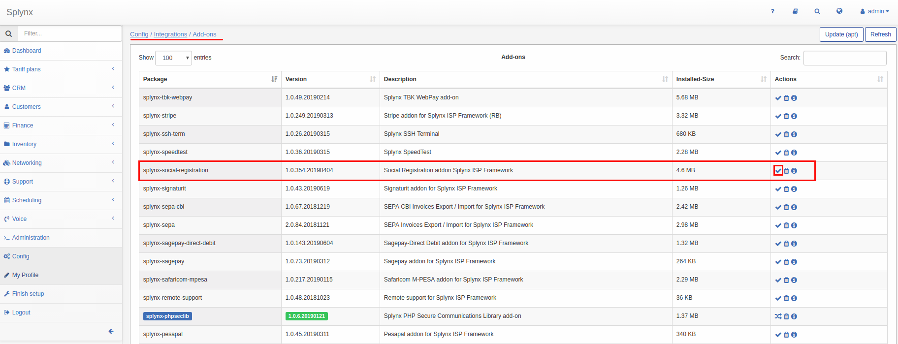


Login to the Splynx-portal via social networks appears on the portal page.


After Installation you have to configure add-on under _Config / Integrations / Modules List_.

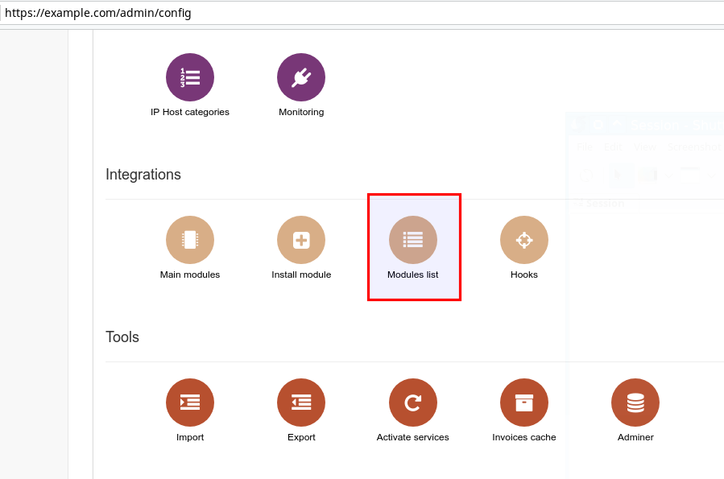


You may enable or disable **Entry Points**. There are two entry points in configuration.

The first one provides ability to sign-in to Splynx-portal using social networks.


The second one provides ability of registration via social networks.


Edit URL of your server:

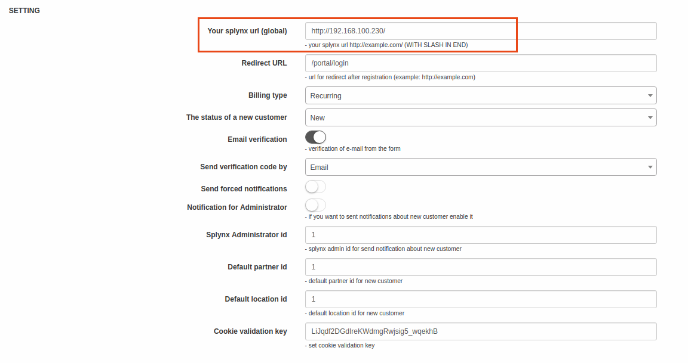

Enable social networks that you want to use:

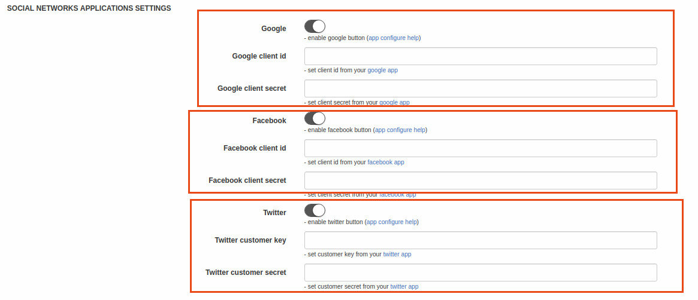

You can enable [TowerCoverage](addons_modules/towercoverage/towercoverage.md) integration:


Change setting and press **Save**.

* * *

**Registration**


Customer needs to Enter required information, and press **Sign In** button.


* * *

## **Login customer to Splynx-portal**

* Login with Facebook  
    If customer is not logged in Facebook, he will be prompted to log in into Facebook and then redirected to Splynx-portal.
    

* Login with Google
    If customer is not logged in Google+, he will be prompted to log in into Google and then redirected to Splynx-portal.
    

* Login with Twitter  
    If customer is not logged in Twitter, he will be prompted to log in into Twitter and then redirected to Splynx-portal.
    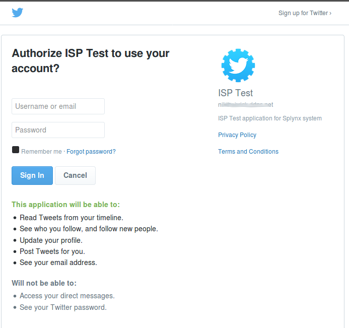

Information about social-network is stored in _Customer / Information / Additional information_ in the field **Social ID**

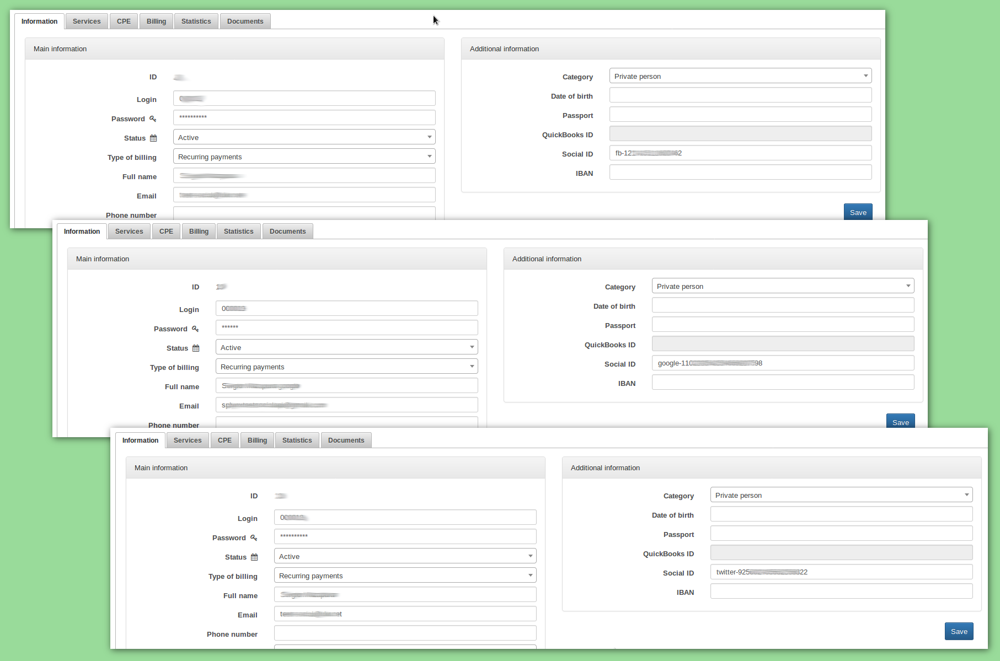

* * *

**How to create and enable API-apps in Google+, Facebook, and Twitter**

### **Google API**

You need a Google API Console project to integrate Google Sign-In into your Splynx-site. To create a Google API Console project and client ID, follow these steps:

* Go to the Google API Console ([https://console.developers.google.com/projectselector/apis/library](https://console.developers.google.com/projectselector/apis/library))
* Select an existing project, or create a new one
    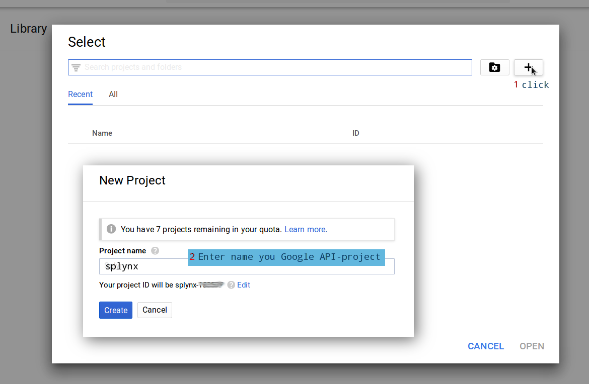

* In the sidebar under **APIs & Services**, select **Credentials**, then select the **OAuth consent screen** tab  
    

* Choose an **Email Address**, specify a **Product Name**, and press **Save**
    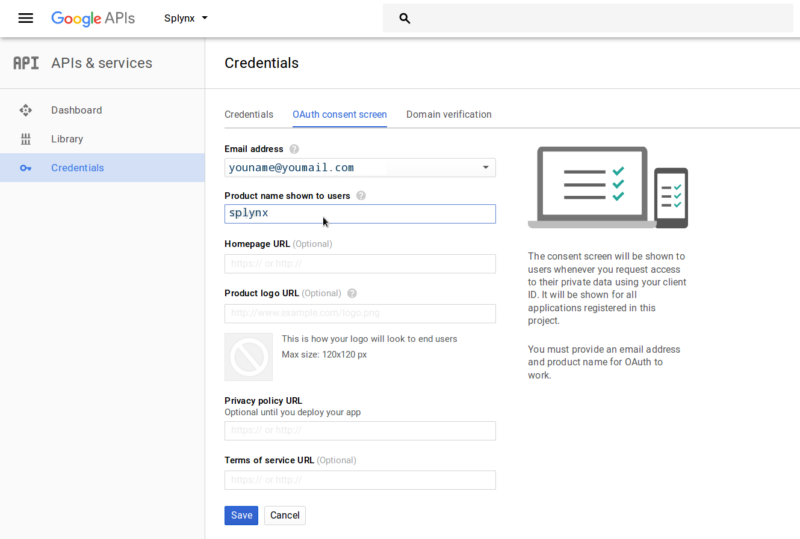

* In the **Credentials** tab, select **Create credentials** drop-down list, and choose **OAuth client ID**
    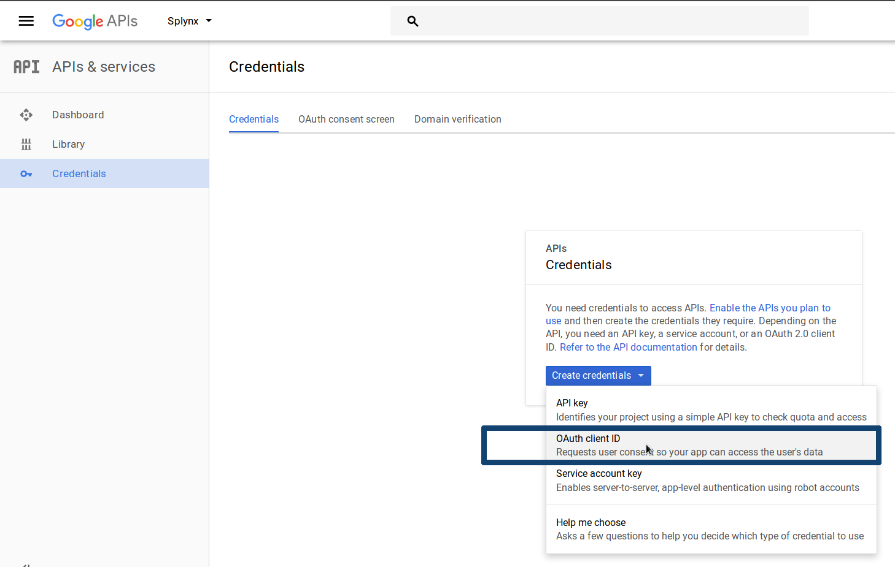

* Under **Application type**, select **Web application**
    **Authorized JavaScript origins** - URL of your Splynx-server
    **Authorized redirect URIs** - enter these values:
    1) `https://splynx.youdomain.com/register/site/auth?authclient=google`
    2) `https://splynx.youdomain.com/register/login/auth?authclient=google`

    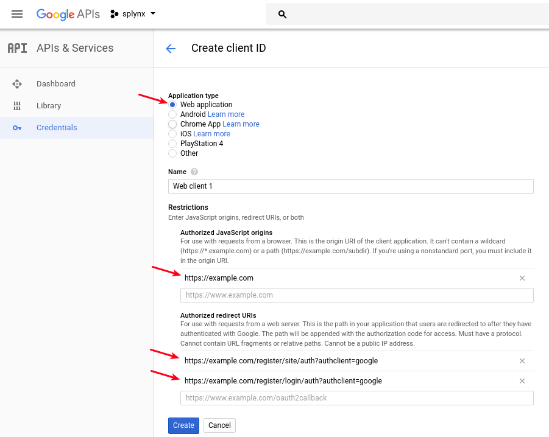

* Click **Create**

**NOTICE:** If the customer receives this error message during registration or sign-in process, then add _wrong_ URI (1), to **Authorized redirect URIs** list.

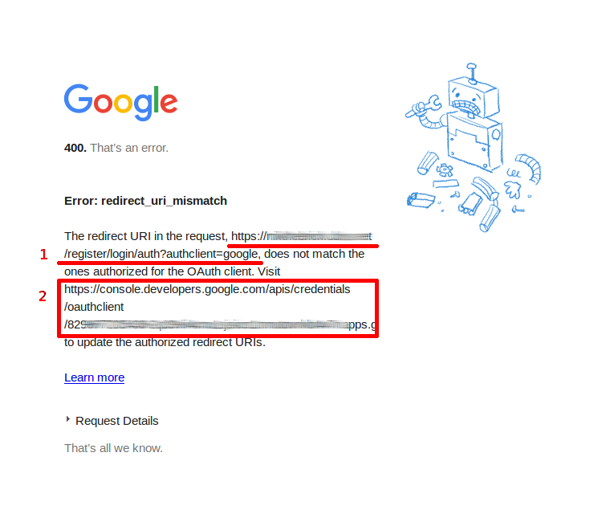

* From the resulting OAuth client dialog box, copy **Client ID** and **Client secret** to Splynx.
    

* And, finally, turn on the Google+ API ([https://console.developers.google.com/apis/library/plus.googleapis.com](https://console.developers.google.com/apis/library/plus.googleapis.com))  
    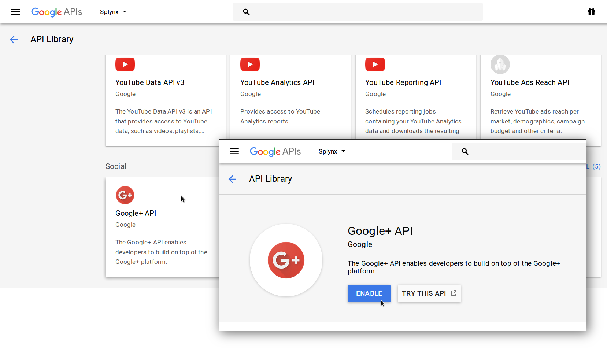

Reference: [Google documentation](https://developers.google.com/identity/sign-in/web/devconsole-project)

### **Facebook API**

To integrate Facebook Login into your Splynx-site, you must have a Facebook API.
**Notice:** Splynx-site must use HTTPS. It is required by Facebook.

* Go to developers portal [https://developers.facebook.com/apps](https://developers.facebook.com/apps)
* Create App
    

* In **Select a product** select **Facebook Login** (click **Set Up**)  
    

* Do not use **Quickstart**, use **Settings**
    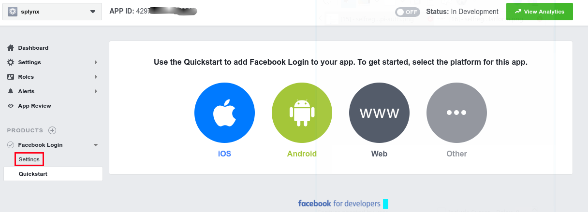

* Enter **Valid Oauth redirect URIs**:
    1) `https://splynx.youdomain.com/register/site/auth?authclient=facebook`
    2) `https://splynx.youdomain.com/register/login/auth?authclient=facebook`
    

* Click **Save Changes**

* Go to App _Settings / Basic_, copy **App ID** and **App Secret** to Splynx  
    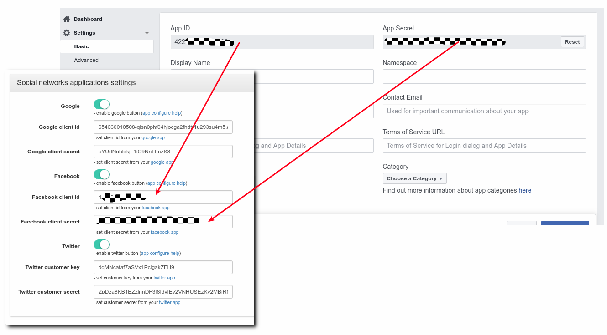

* Enable App as **Public** (from **App Review**)
    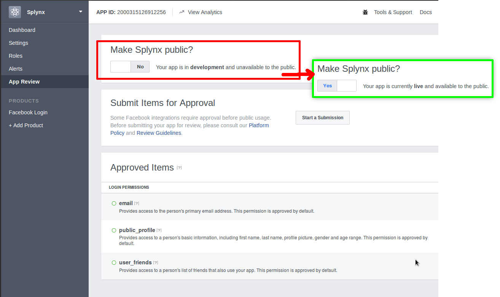

Reference: [Facebook documentation](https://developers.facebook.com/docs/facebook-login)

### **Twitter API**

For Twitter integration, go to page Application Management - [https://apps.twitter.com/](https://apps.twitter.com/)

* Create New App
    

* Enter application **Name**, **Description**, **Website**, **Callback URL** (http://splynx.youdomain.com/register/login/auth?authclient=twitter), and click button **Create your Twitter application**
    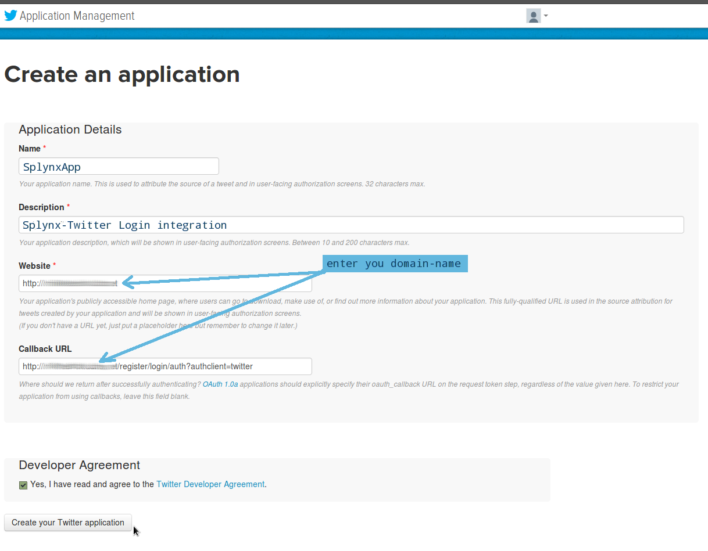

* From tab **Keys and Access Tokens** copy **Consumer Key (API Key)** and **Consumer Secret (API Secret)** to Splynx  
    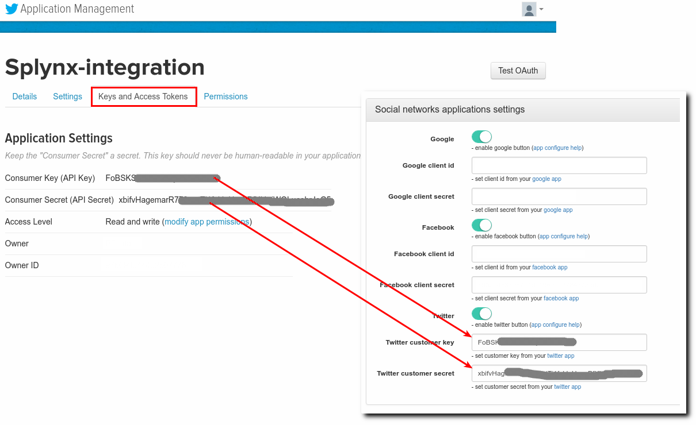
* Go to **Permissions** and enable **Request email addresses from users**  
    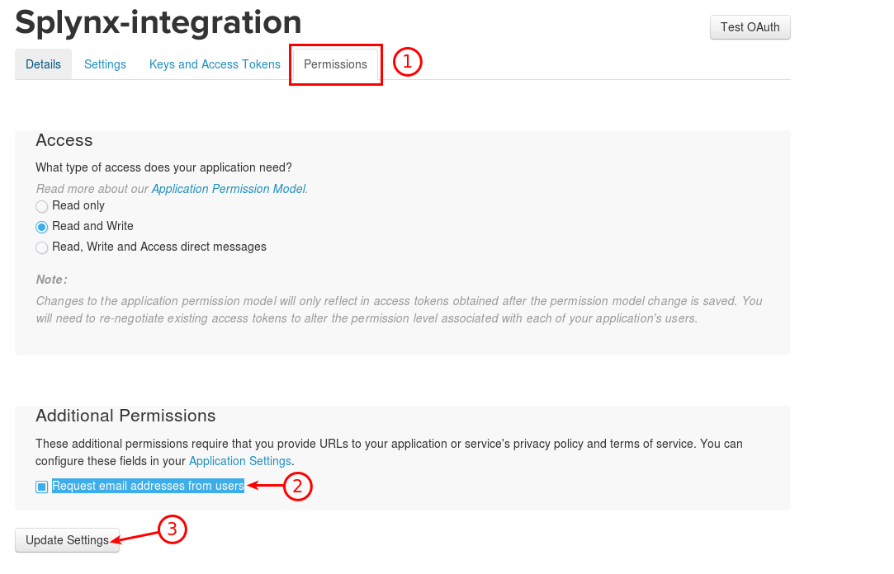

* * *

[TowerCoverage Integration](addons_modules/towercoverage/towercoverage.md)
