Xero accounting (Add-on is outdated and didn't support)
=============================================

**(Add-on is outdated and didn't support)**

Splynx is able to sync Customers, Invoices and Payments with Xero accounting software - https://www.xero.com

The logic of the process is:

    Splynx synchronizes the customer database with Xero
    Splynx issues invoices/charges customer on Billing day
    All invoices generated in Splynx are pushed to Xero
    Payments are processed in Splynx (Cash, Paypal, Bank statement processing, Debit orders, Authorize.net, Credit cards)
    Payments are pushed from Splynx to Xero and invoices in Xero are marked as paid

To setup Splynx and Xero integration we have to go through several steps.

Before all else, we need to install the Splynx Xero module:

     apt-get update

     apt-get install splynx-xero-addon

Then, first step is to create account in Xero (if you don't have one already):
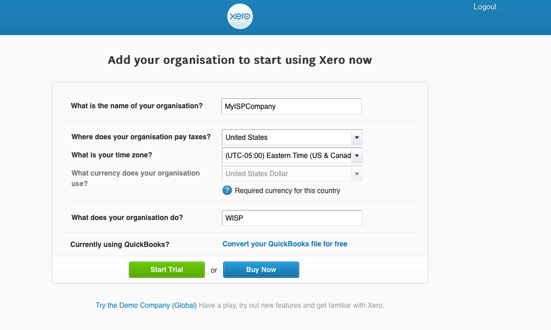
When account is created, we need to activate Xero API, which is located at https://app.xero.com/Application/
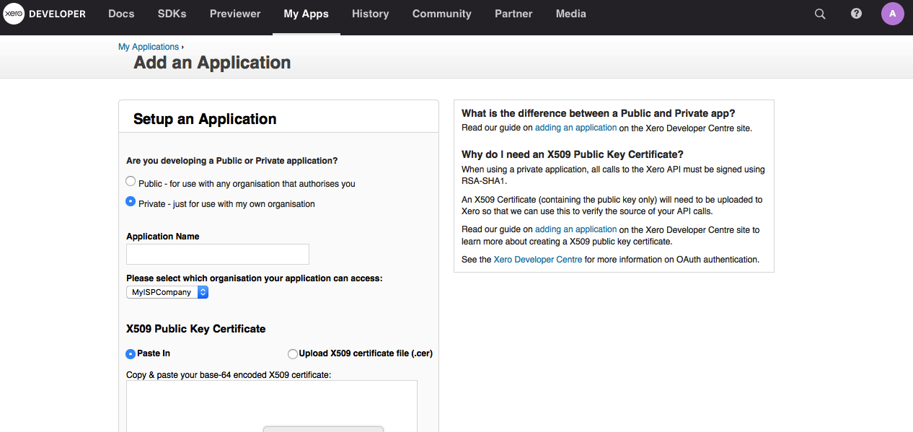

Splynx is used as a Private application and we need to take a public key from Splynx and copy it to X509 Public key field to Xero Application settings.

It's located on Linux Splynx server, path /var/www/splynx/addons/splynx-xero-addon/config/certs, file publickey.cer:
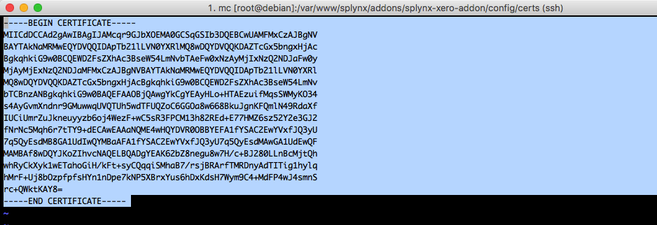
Copy and paste it into Xero Application window:

Xero creates Consumer Key and Consumer Secret, which we copy and paste into Splynx file path /var/www/splynx/addons/splynx-xero-addon/config/params.php:
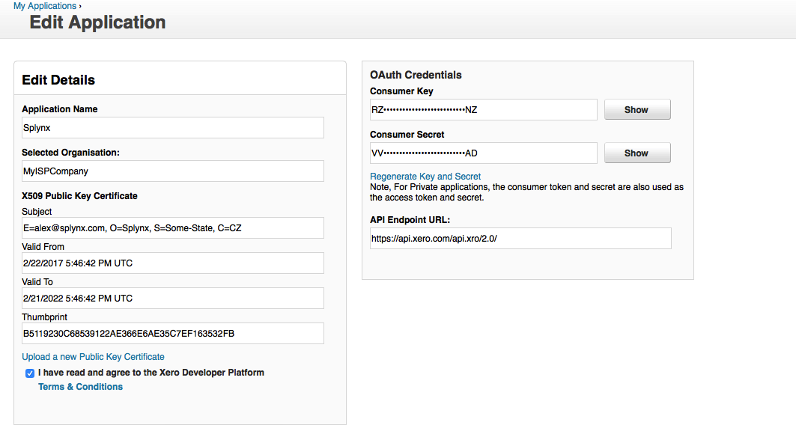

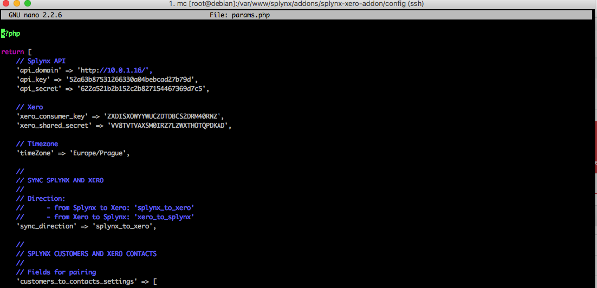
After these steps, Xero module should appear in Finance tab of Splynx and it should show us Xero module interface, where we can start syncing plans, customers and taxes:

**Synchronizing of Taxes and Tariff plans**

Sales Tax or VAT depends on a country and it is different. In Splynx each plan has a tax field called VAT. Tax value in Splynx should correspond with Sales Tax in Xero. For example, if we have a Sales Tax 0%, we can leave Xero default settings, in case when Tax is different, we should change it or add more taxes in Xero. Taxes in Xero are located in Settings → Tax rates:
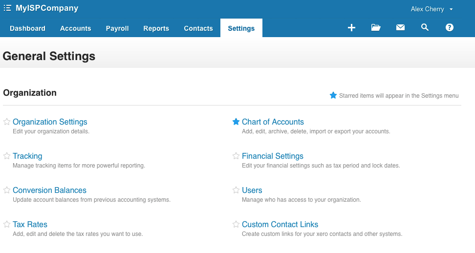
We change it to 21%, because the local tax of testing company is 21%:
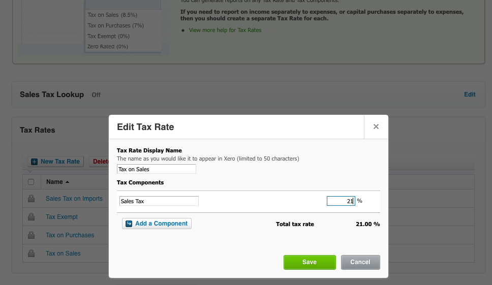
Then, it's important to verify, if Taxes are loaded properly in Splynx Xero module:

When Tariff plans are defined in Splynx, it creates services in Xero accordingly. Important is to define correct Sales Account number in Splynx plans. Xero has the list of all accounts according to the country where software is used. For example, Sales account for all sales in our example is 400, so it's needed to enter to Splynx plans value 400 in Sales Account field:
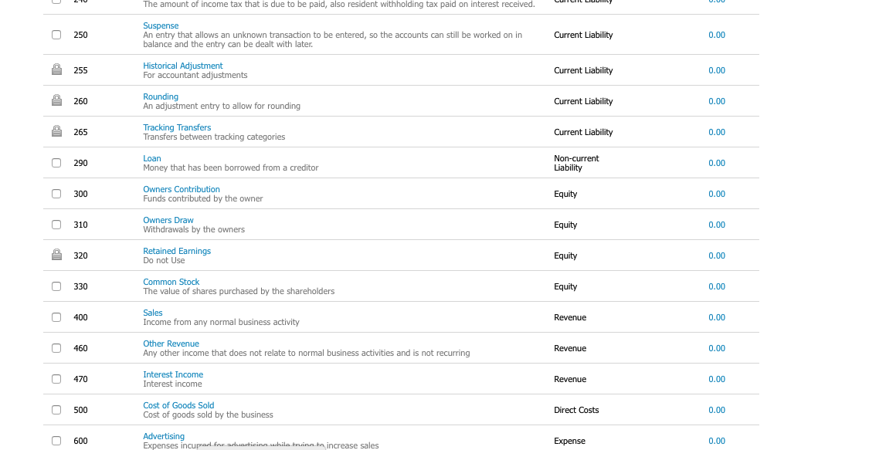
Let's match all plans (internet, voice and custom) to Sales account 400:
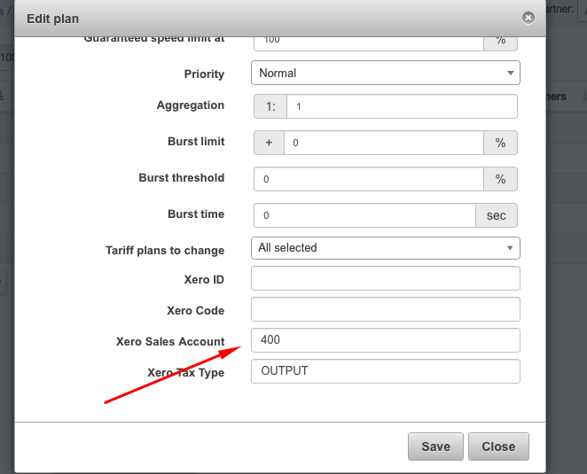
When taxes are ready, next step is to synchronize all Splynx plans with Xero services. Example of Internet plans sync is below:
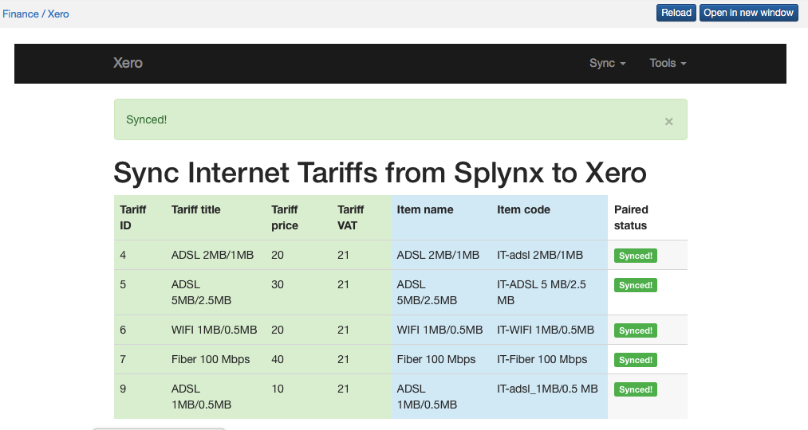
Voice plans sync:
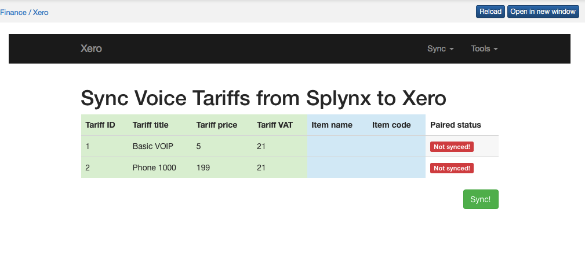
As soon as we synchronize all plans, Xero ID should appear in Tariff Plan settings in Splynx:
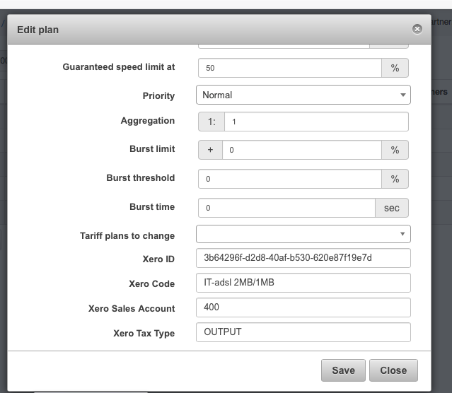
**Pushing customers from Splynx to Xero and vice versa.**
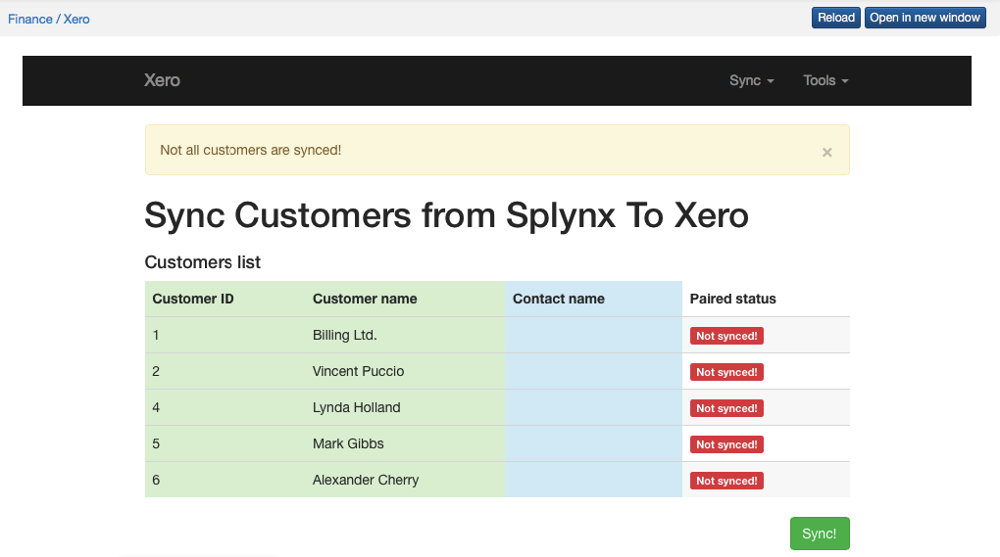
After clicking Sync button Splynx customer accounts will be created in Xero:
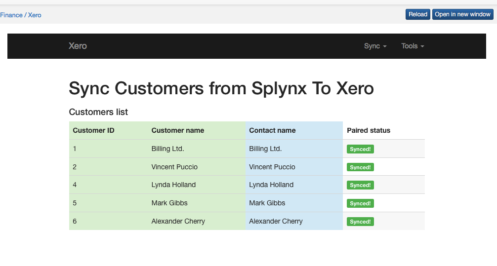
Xero view:
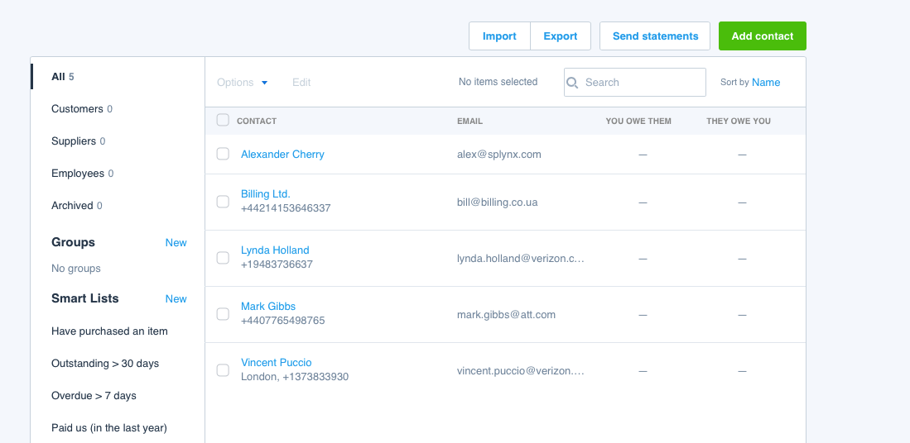
Also, there is a way how to push existing customers from Xero to Splynx, or match entries in Xero with existing accounts in Splynx:
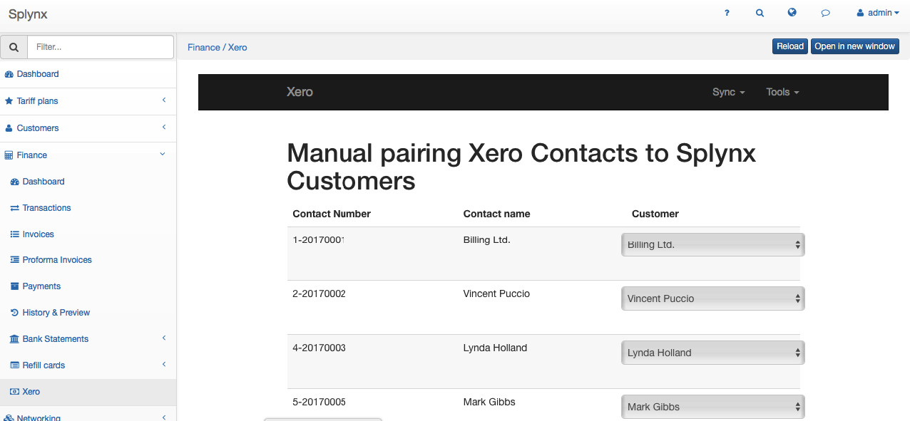
**Invoice and Payment synchronization with Xero**

Splynx generates invoices for all customers with enabled billing engine accordingly to their Billing day. If billing day is set as 1, invoice to customer will be created on 1st day of the month. If, for example, Billing day is 15, Splynx will generate invoice  on 15th day of the month for the period: 15th - 14th of the next month. Splynx is able to charge customers in advance or charge for services already provided. All invoices are sent from Splynx to Xero during 1 hour of creation. Here are invoices generated in Splynx:

They are also created automatically in Xero:
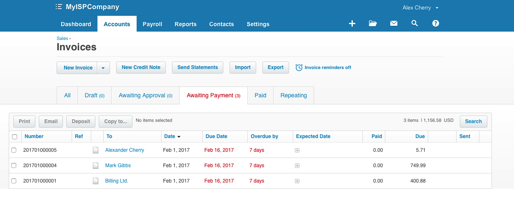
Invoices in Splynx and Xero contain the same information. The PDF design can also be exactly the same, numbering sale as well:
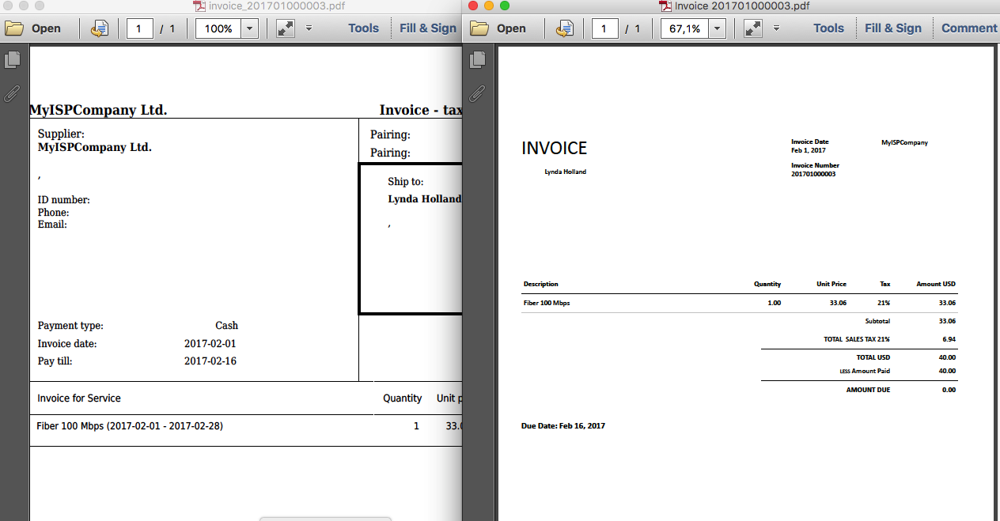
When payment arrives to Splynx, we also send it to Xero and mark Xero invoices as paid:
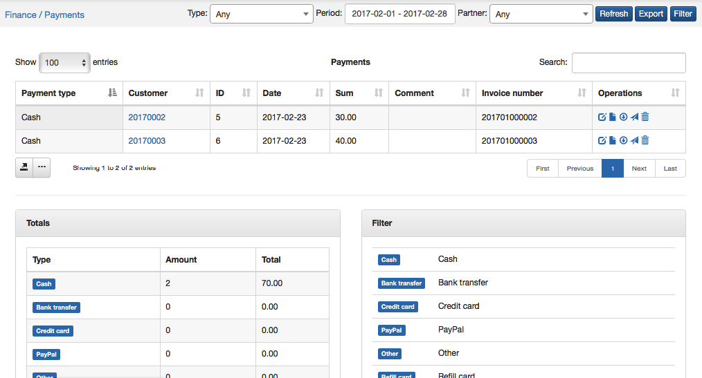
Xero view of paid invoices:
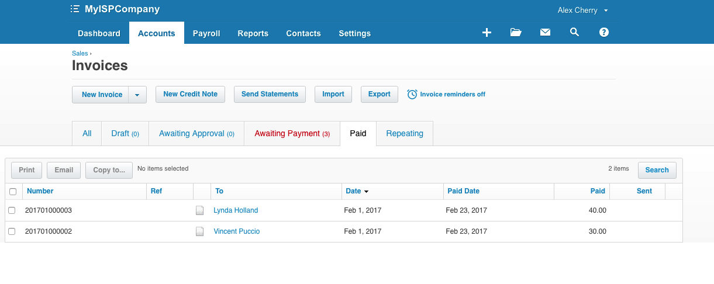
To sync Invoices and Payment on the fly we need to enable WebHooks inside Splynx settings, please open menu Config → Hooks:
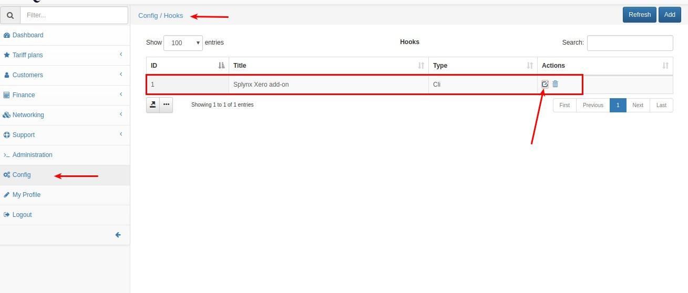

Video:

https://www.youtube.com/watch?v=7WQFOq5ZyfU#action=share
