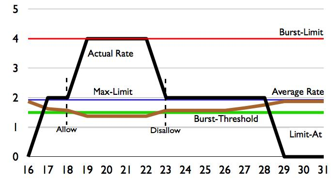
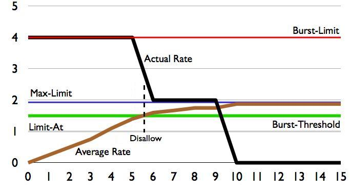

Burst speed concept
===================

Burst is a technology that is part of Splynx bandwidth manager. It's supported by Mikrotik RouterOS devices. Splynx can create speed limits with burst option via Radius protocol or via API.

The Burst concept allows customers to transfer data at a higher rate/speed than that which is specified in their tariff plan but only for a certain time period. When configured, this concept is applied when the **average-rate** of a queue for the last **burst-time** (seconds) is smaller than the **burst-threshold** value. Once the **average rate** of a queue reaches or exceeds the value of the **burst-threshold** within the **burst-time**, this function is stopped and the customer's data transfer speeds reverts back to the intended speed of their tariff plan.

When burst is applied, the **burst-limit** value replaces the **max-limit** value inside the queue.

## Descriptions of the burst terminology and Splynx usage:

**burst-limit** (set in %) : it is the maximal upload & download speed customers can obtain when the burst feature is enabled. It is configured based on a percentage(%) of the speed, of the tariff plan. For example, if a customer has a 2 Mbps plan and the burst-limit in Splynx is set to 100%, the customer will obtain burst speeds of 4 Mbps. Whereas, if the burst-limit in Splynx is set to 50%, the customer will obtain burst speeds of 3 Mbps instead of the original 2 Mbps of the plan.

**burst-time** (seconds) : the period of time when the average data rate is calculated. Please note this is not the time when burst is active.

**burst-threshold** (set in %) : Burst technology always compares the average speed with the threshold. When the average reaches the threshold, burst is disabled. Like the **burst-limit** we also define the threshold in percentage(%) within Splynx. For example, if we set the burst threshold to 80% of a 2 Mbps plan, the threshold speed value will be set to 1.6 Mbps. Therefore, burst will be deactivated when the average speed, during burst-time, reaches 1.6 Mbps.

**average-rate** (not configured in Splynx, default value) : Every 1/16 part of the **burst-time**, the Mikrotik router calculates the average data rate over the last **burst-time** seconds

**actual-rate** (read-only value): actual traffic transfer rate of the queue, illustrations of this can be found in the image below for a better understanding of the concept. In the picture is an example of a plan with the burst-time set to 16 seconds, tariff speed of 2 Mbps and burst-rate of 4 Mbps, the threshold is set to 1.6 Mbps.

To configure a burst function like the one above, your Splynx burst parameters should be set as follows:

We recommend using burst times of 30 or 60 seconds, and threshold values around 70-80% of the plan.
