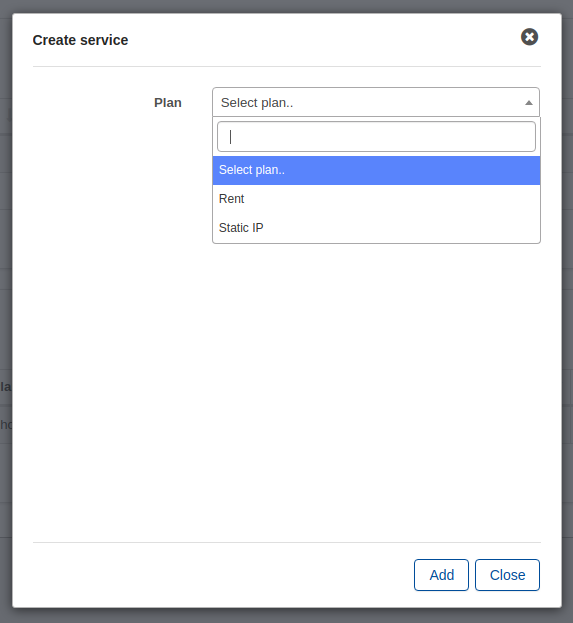
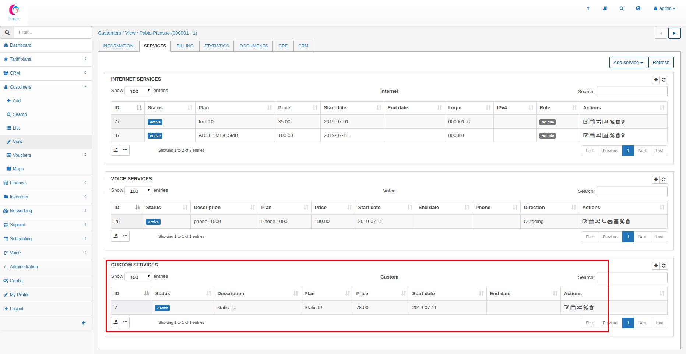

Custom plans
============

Here are all the plans you specifically design to cater to the needs of your company and the services you render uniquely.

For example, certain ISP's provide public IP services to users; Rental of equipment; Hosting or IPTV services are examples of custom tariff plans.

To create custom plans navigate to _Tariff plans → Custom_ and click on Add plan in the top right of the page.

You will be redirected to the add plan page and where you will enter the details of the plan in the provided fields.

* Title - the name of the tariff in the list/table of custom tariffs
* Service name - the description of the plan
* Price - the price for the service
* Partners - the partners this plan will be available to.
* VAT Included - whether VAT is included in the price of the plan or not.
* VAT - the percentage of the VAT
* Tariff plans to change (available in customer portal) - the list of other tariffs available for changing from the current tariff in the customer's portal
* Types of billing - the types of billing the plan will be available to
* Prepaid (custom) period - by default, it is set to monthly and customers will be charged for a period of a month, but it is possible to select "Days amount" which will cause another field to appear:" _Custom period (days)_" - this will allow you to set a custom period in days. (7 days (week), 10 days, etc up to 365 days)

* Available in self-registration -  enables/disables the availability of the tariff when customers sign up for services via the social/self-registration addon

Once custom plans has been created, it is possible to edit or to delete them with the icons found in the actions column of the voice plans table.  <icon class="image-icon"></icon> or <icon class="image-icon"></icon>

Like all tables in Splynx, you can modify the appearance of content, content to display and export the table into Excel, CSV or PDF formats, you can also choose to copy or print the table. This is done with the use of these <icon class="image-icon"></icon>  icons found at the bottom left of each table. The <icon class="image-icon"></icon> icon is used to export and the   <icon class="image-icon"></icon> icon is used to format the appearance and content of the table.

After creating a custom plan, you can now assign it as a service to a customer. To assign a service to a customer, navigate to _Customers → List_, select the specific customer, navigate to their _Services_ tab and simply click on the *Add service* button located at the top left of the page.

A window will appear to create the service, where you will select a plan from the drop-down list and specify the data in the fields provided for the service.

Once you have completed the service data form and added it, it will appear in the service table of the customer.

