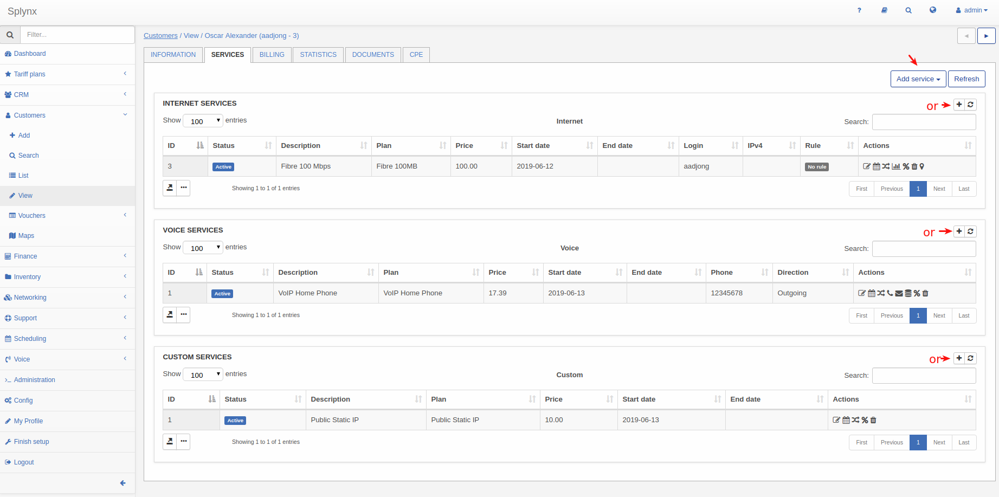
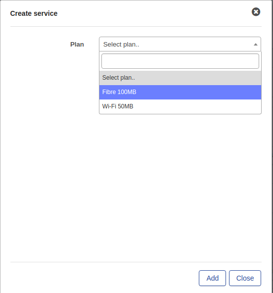
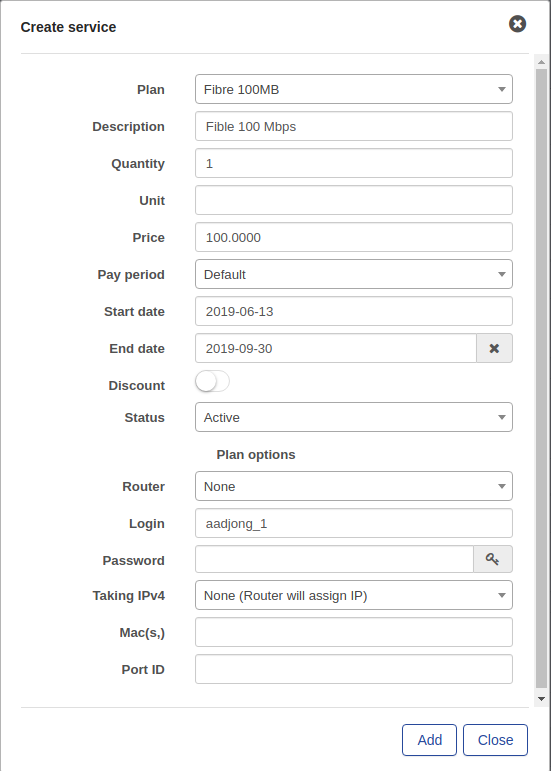
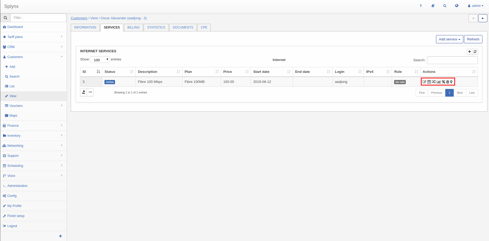

Customer services
==========

It is possible to associate different services for every customer: `Internet services`, `Voice services` and `Custom services`.
In order **to add a new service** for the customer, select the *Customer view* and click on `+` sign next to the service (make sure customer is in Active status).

A window will pop up and it will be possible to select the service.

* **Tariff** - the tariff (`Internet`, `Voice`, `Custom`)
* **Description** - a description of the tariff
* **Quantity** - the quantity
* **Unit** - a unit of measurement is a definite magnitude of a quantity (is using for invoices - for example: m., ft, ...)
* **Price** - the price
* **Start date** - when the service will start
* **End date** - when the service will end
* **Discount** - it is possible to set a discount with the percentage, start and end dates of the discount
* **Status** - the options are `Active`, `Disabled`, `Stopped`, `Pending`, `Archived`.
  * **Active** - Usual status for work.
  * **Disabled** - Service with data end reached.
  * **Stopped** - Used for set customer to status Inactive, when customer will be activated , it will be automaticly changed to Active.
  * **Pending** - Waiting when will be activated.
  * **Archived** - Only for future information.

***Tariffs options***
* **Router** - we can select the router
      
    This field is required when Mikrotik API are used.
  

* **Login** - the login

* **Password** - the password

   If you create a service with an empty password, the password will be really empty but during authorization customer's password will be used.

* **Tacking IPv4** - the options are None, Permanent IP, Dynamic IP

* **Mac(s)** - MAC address(es). Separated by comma.

   Only the first MAC address will be used if **Authorization/Accounting** for the router is **Hotspot (Users) / API Accounting** or **PPP (Secrets) / API Accounting**

* **Port ID** - the port ID

You can edit **tariff/service**, check its statistic, see the graph of services or delete them by these actions 

