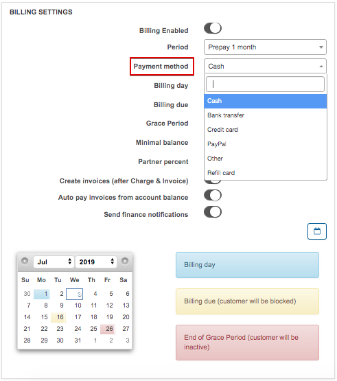
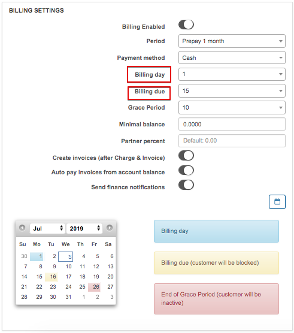

## Recurring billing engine

Recurring billing is the best solution for ISP's charging customers' a fixed price on a recurring basis typically at the beginning of the billing cycle. The Recurring type of billing is selected by default in the Splynx global configuration.

You can set up a **recurring billing** for a customer in the Customer Information section (`Customers → View`), by clicking on *Type of billing* option and choosing *recurring billing* as a type of billing.

---------
**Recurring Invoices** can be issued every month in advance with *Prepay* or in *Postpay* Mode.

The logic around prepay is, for example, on the 1st of May, Splynx will generate invoices for the period of 1 - 31 of May.

Postpay means that Splynx will generate invoices on the 1st of May for the period of 1-30 of April.

Customers using the recurring billing type can be set to use Postpay or Prepay mode, navigate to `Customers → View → Billing → Billing overview`.

In Billing settings, click on the "Period" drop-down list and choose between Postpay or Prepay mode with options to pay up to 12 months in advance.

Choose a *Payment Method* for recurring billing, options available are Cash, Bank Transfer, Credit Card, PayPal, Refill Card, BrainTree and others when installed and configured.

---------
The next step of setting up "Recurring billing" will be to choose the *Billing day*, *Billing due day* and a *Grace period*.

* **Billing day** - the day invoices will be generated automatically.

* **Billing due day** - the amount of days after the billing day the customer has to make payments before getting blocked.

* **Grace period** - the number of days after the billing due until the system will automatically mark the customer status as inactive and
In our example, we choose the 1st day of the month as the billing day and 15 days thereafter, as the Billing due day. This means that invoices will be generated on 1st day of the month and if the customer fails to make a payment before or on the 15th day of the month, the customer will be blocked and his services will be suspended.

***Please note that it is important to enable grace period processing under Config / Finance / Automation, for your grace periods to work as expected***:

* **Minimal balance** - the minimum amount funds to be available in the customer's account after service charges to avoid being blocked, this field is 0.0000 by default.

Bear in mind, although the customer is blocked and their services suspended, the system will still account for the services from a billing perspective.

The system will only stop accounting for customer billing when the status has changed to **inactive**.

