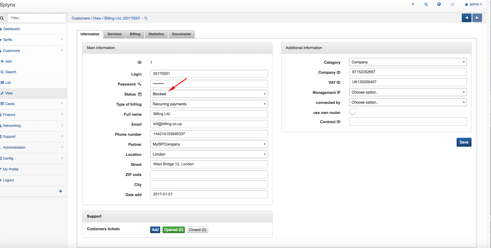
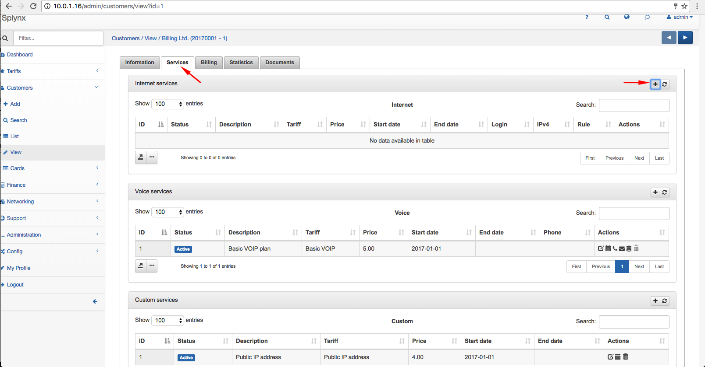
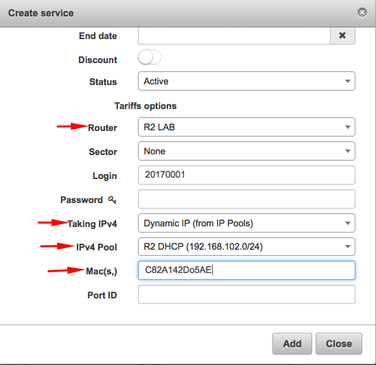

Mikrotik: DHCP with Radius
==========

#### Associate a permanent IP to a client

To configurate the Splynx Radius Server with the DHCP service you should have a DHCP server configured on the interface of your router. Select your DHCP server and make sure you have the option "Use RADIUS" flagged. Also, make sure you have selected in Address pool "static only" (the DHCP is going to get the IP from the Splynx RADIUS server).


To configure the Splynx Radius Server, click on `Networking → Routers → List`, select the router where you have configured your dhcp service, click on the *"Authorization/Accounting"* window and select DHCP *(Radius)/ API accounting).*


Click on IPv4 `Networks → Add` and create the network you want to use with the dhcp service. Don't forget to select Static in Type of usage.


Click on `Customers →  List`, select a customer and click on the tab Services. Now you can add a new service, just click on the +.


When you add the service, you should pay attention to three fields:

* **Router** - select the router that is used with the dhcp service
* **Taking IPv4** - select Permanent IP ( from static IPs)

IPv4 - IP you want to be associated with the customer

* **MAC (s)** -  MAC address of the customer


 Mikrotik even with AAA enable, doesn't send DHCP statistic. In order to get statistic, you should enable an API on Splynx Radius server.

Click on `Networking →  List`, and select the router where you have configured your dhcp service. Click on the tab Mikrotik, put Enable Api on and insert a login and password of an administrator (be sure that the administrator is created in the router also).


#### Associate more than one MAC Address to a client

To associate more than one MAC address to a client you should create a new service with a new MAC address, and set the price to 0 to not charge the client twice.


As you can see from the screenshot, the DHCP service is going to release a second IP associated to a different MAC address.


It is possible to block a permanent IP address assigned from the DHCP service through an API. Click on `Networking → Routers → List`, select the router where you configured your dhcp service, click on the tab Mikrotik and set the mode *"Disabled customer to Address-List"* on. Go to the *Customer's Status* and select *Blocked*.




The user will be blocked and his internet traffic will be redirect to a Reject IP for blocked users defined in `Config → Networking → Radius`.


#### Associate a dynamic IP to a client.
This setup is not recommended to use.

To configure the Splynx Radius Server with the DHCP service, you should have DHCP server configured on the interface of your router. Select your DHCP server and make sure you have the option *"Use RADIUS"* flagged. In Address pool you have to select *"Static only"* (DHCP is going to get IP from the Splynx RADIUS server).


To configure the Splynx Radius Server, click on `Networking → Routers → List`, select the router where you have configured your dhcp service, click on the *Authorization/Accounting* window and select DHCP (Radius)/ API accounting.


Click on IPv4 `Networks  Add` and create the network you want to use with the dhcp service. Don't forget to select Pool in Type of usage.


Click on `Customers →  List`, select a customer and click on the tab Services. Now you can add a new service, just click on +.



When you add the service, you should pay attention on three fields:

* **Router** - select the router that is used with the dhcp service
* **Taking IPv4** - select Dynamic IP (from IP Pools)

IPv4 pool - the IP pool you want to be associate with the customer

* **MAC(s)** -MAC address of the customer




It is possible to get statistic from the DHCP dynamic assignment. Open your ssh client and connect to Splynx Radius Server, go to `/var/www/splynx/config`.


Edit radius.php and set add_to_online value equal to true. Restart the Radius Daemon with
```
service splynx_radd restart.
```


When customer has a dynamic IP, the API blocking will not work and you need to use a hack. Just go to the DCHP server parameters in your Mikrotik router and set *Lease Time* 1 day.


In Splynx, click on ``Config → Networking → Radius`` and click on *Load*. In Rate-Limit attributes, add the string "Session-Timeout = 86400" (seconds in 24 hr).


