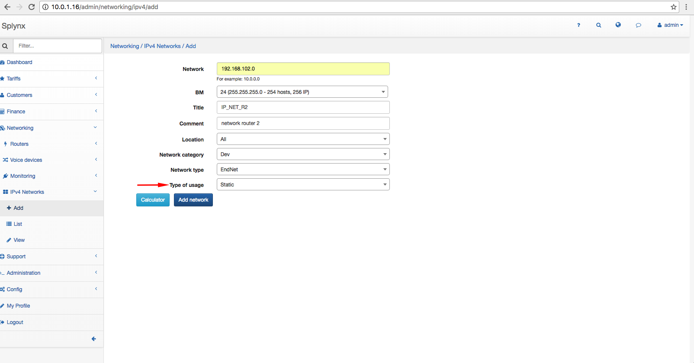
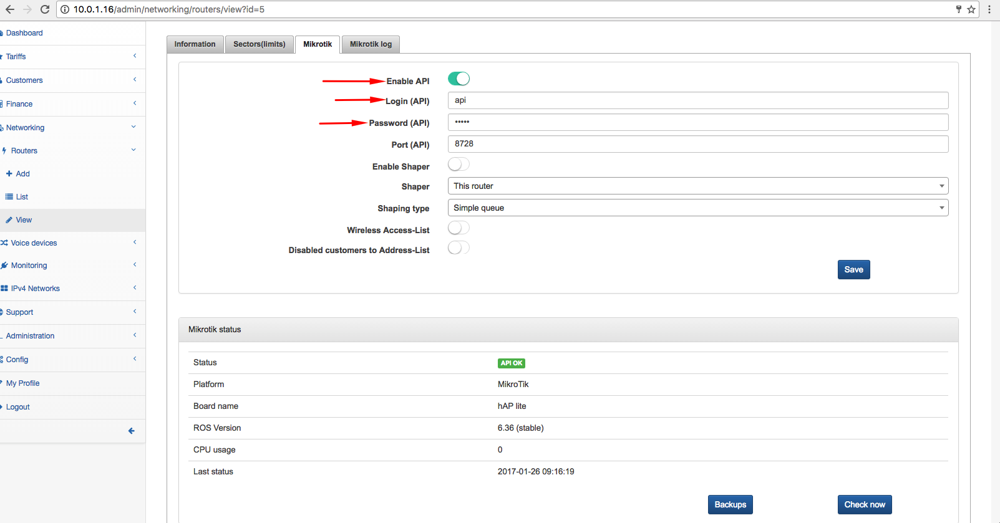
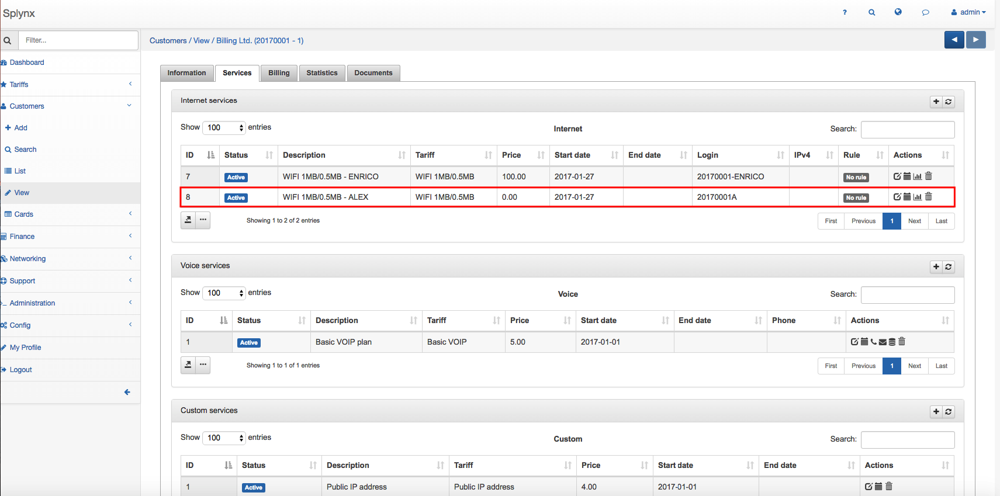
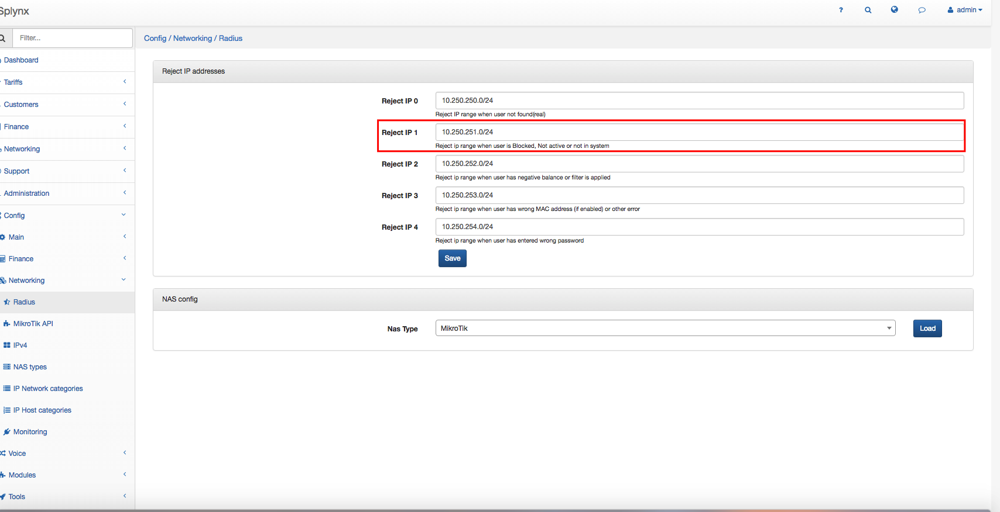
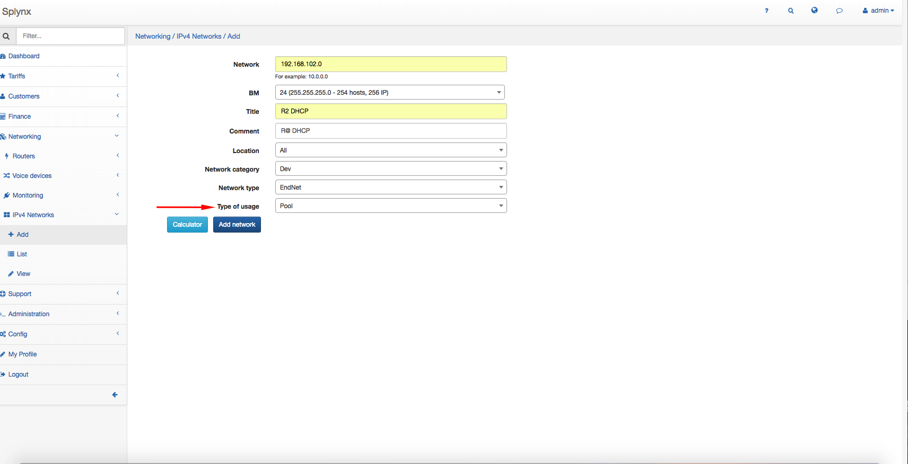
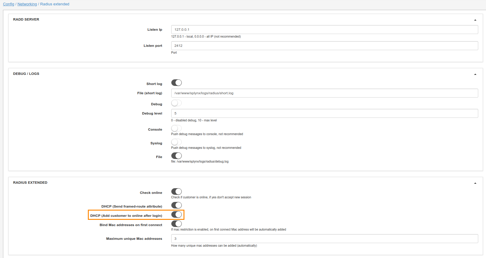
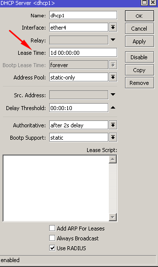

Mikrotik: DHCP with Radius
==========

#### Associate a permanent IP to a client

To configure the Splynx Radius Server with the DHCP service you should have a DHCP server configured on the interface of your router. Select your DHCP server and make sure you have the option "Use RADIUS" flagged. Also, make sure you have selected in the Address pool "static only" (the DHCP is going to get the IP from the Splynx RADIUS server).


To configure the Splynx Radius Server, navigate to `Networking → Routers → List`, select the router where you have configured your dhcp service, click on the *"Authorization/Accounting"* window and select DHCP *(Radius)/ API accounting).*


Click on `IPv4 Networks → Add` and create the network you want to use with the DHCP service. Don't forget to select Static in the Type of usage.



Click on `Customers →  List`, select a customer and click on the Services tab. Now you can add a new service, just click on the "+" button.


When you add the service, you should pay special attention to the following three fields:

* **Router** - select the router that is used with the dhcp service
* **Taking IPv4** - select Permanent IP ( from static IPs)

* **IPv4** - IP address you want to assign to the customer

* **MAC (s)** -  MAC address of the customer


<icon class="image-icon"></icon> Please note, even with AAA enabled on a Mikrotik router, it does not send DHCP statistics. In order to get statistics, you should enable an API on the Splynx Radius server.


Navigate to `Networking →  List`, and select the router where you have configured your dhcp service. Click on the Mikrotik tab, Enable API and insert a login and password of an administrator (be sure that the administrator is created on the router as well).




#### Associate more than one MAC Address to a customer

To associate more than one MAC address to a customer, it is necessary to create a new service, with a new MAC address, and set the price to 0 to ensure that the customer will not be charged twice.




As you can see from the screenshot, the DHCP service is going to release a second IP associated to a different MAC address.


In Splynx, we have the ability to block a permanent IP address assigned from the DHCP service through an API. To block a permanent IP, navigate to `Networking → Routers → List`, select the router where you configured your dhcp service, click on the Mikrotik tab and enable the *"Disabled customer to Address-List"* option. Navigate to the respective customer and change the *Customer's Status* to *Blocked*.


The user will be blocked and their internet traffic will be redirected to a Reject IP for blocked users defined in `Config → Networking → Radius`.




#### Associate a dynamic IP to a customer.
<icon class="image-icon"></icon> We do not recommend the use of this setup.

To configure the Splynx Radius Server with the DHCP service, you should have a DHCP server configured on the interface of your router. Select your DHCP server and make sure you have the option *"Use RADIUS"* flagged. In the Address pool, you have to select *"Static only"* (DHCP will get an IP from the Splynx RADIUS server).


To configure the Splynx Radius Server, navigate to `Networking → Routers → List`, select the router where you have configured your dhcp service, click on the `Authorization/Accounting` drop-down menu and select the `DHCP (Radius)/ API accounting` option.


Thereafter, navigate to  `IPv4 Networks → Add` and create the network you want to use with the dhcp service. Don't forget to select Pool in the Type of usage.



Finally, you can navigate to `Customers →  List`, select a customer and click on the Services tab to add a new service, simply click on the "+" button.


When you add the service, you should pay special attention to the following three fields:

* **Router** - select the router that is used with the dhcp service
* **Taking IPv4** - select Dynamic IP (from IP Pools)

* **IPv4 pool** - the IP pool you want to use to assign an IP to the customer from

* **MAC(s)** -MAC address of the customer


It is possible to get statistics from the DHCP dynamic assignments. Navigate to `Config / Networking / Radius extended_`and enable the **DHCP (Add customer to online after login)** option.  




Restart the Radius Daemon with the **Restart radius** button at the bottom of the page under `Radius Tools`.


When a customer has a dynamic IP, the API blocking will not work and you will need to use a hack. Navigate to the DCHP server parameters on your Mikrotik router and set the *Lease Time* as 1 day(1d 00:00:00).




Therafter, in Splynx, navigate `Config → Networking → Radius` and click on *Load*. In the Rate-Limit attributes, add the string "Session-Timeout = 86400" (equivalent to 24 hrs in seconds).


#### Troubleshooting

**Additional network issue**  
If you set additional network(s) in Splynx internet services, network routes will be sent to the router (NAS) during authorization. The router will then send all traffic with destination=additional network to the customer device.
It is possible that these routes will also appear on the customer's device. To fix this issue, set _use-framed-as-classless_ to _no_ in the DHCP server settings.

Example:  
```
 /ip dhcp-server set use-framed-as-classless=no [find name=dhcp1]
```
