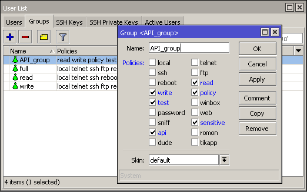
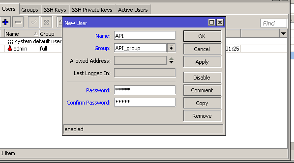
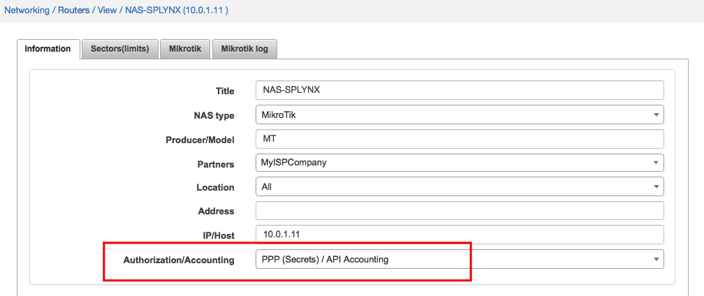
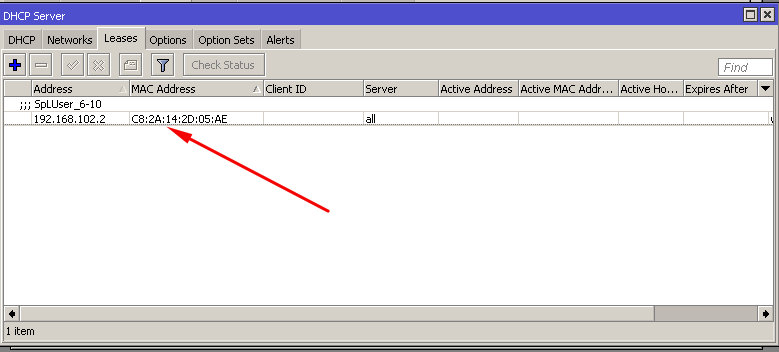

Mikrotik: Local auth, API
==========

Instead of using Radius, Splynx is able to push authentication rules for customers to Mikrotik router via API. The advantage of this approach is that, the rules for authentication are created in routers and are stored there locally. This means that, if Splynx or the Radius server does not respond, customers will still be able to authenticate. The disadvantage is that, the router will always have to be specified in customer settings where the customer is connected, also, customers can only get a permanent IP from Splynx. Another disadvantage is that the live bandwidth monitoring wont work


The following authentication rules can be added via API:

* PPP Secrets
* DHCP Leases
* Hotspot users

In all types of API authentication it is important to have API enabled on the Mikrotik router and also in Splynx router settings:


After the settings are enabled on both platforms, it is necessary to create a special admin account on the router for Splynx. The admin account will be used by the Splynx API to login to the router and to make any changes thereon. You can create a special access group with the following permissions and then include the admin to this group:





Below are descriptions of all types of API authentications and how Splynx covers it with Mikrotik RouterOS:


### Mikrotik PPP Secrets via API

First of all, select PPP secrets as the type of authentication method in Splynx router settings:




Then, in the internet service of the customer, select the router where Splynx will push authentication rules to and also grab statistics from. The login and password should be specified there and also the Permanent IP address. API authentication works best with permanent/static IP assignments. In a case of using dynamic IP assignment, Splynx will not know which IP is used by customer and will not be able to gather statistics from IP accounting of the Mikrotik router.


After saving, Splynx will connect to the router and create entries in `PPP → Secrets`:


### Mikrotik DHCP Leases via API

The first step is to choose DHCP leases as the type of authentication method in Splynx router settings.


In the internet service of the customer, select the router where Splynx will push authentication rules to and also grab statistics from. It is important to set the MAC address of the customer. Only permanent/static IP assignment will works in API authentication because of the limitations in grabbing accounting statistics from Mikrotik IP accounting:


When we save the service information, Splynx connects to the router and adds static DHCP Leases in *IP → DHCP Server → Leases*



In the settings of the DHCP server you, can select the option, that all non authenticated customers will get IPs from a fake pool and all authenticated customers will get IP's which are set in Leases by Splynx.


### Mikrotik Hotspot users via API

The first step is to select Hotspot users as the type of authentication method in Splynx router settings:


In the internet service of customer: a permanent IP address should be selected and the router should be specified. The login and password are authenticating values for hotspot entry. When using MAC authentication, you should specify the MAC address of the customer here:


When these settings are saved, Splynx creates IP hotspot entries on the Mikrotik router under `IP → Hotspot → Users`:


---
When the authentication type is configured and Splynx has pushed the rules to the Mikrotik router, we are able to see customers coming online in 5 minute intervals. Splynx grabs statistics from the Mikrotik routers via API every 5 minutes. You can find the logs for accounting in Splynx under `Networking → Routers` under Mikrotik API log tab:


### Troubleshooting

If a PPP secret or DHCP lease, or Hotspot user is not created on the router via API, please check if the IP address is specified in the customer's internet service settings. Also, the router should be specified there. For DHCP, be sure to check that the MAC address has been set.

#### Accounting
If you see accounting records in Splynx Mikrotik logs but the accounting data is wrong, please check if IP Fastpath is enabled on the router, if so, please disable it:


---
If you do not see accounting records in Splynx Mikrotik logs, check in the database if the time of the last API connection for gathering accounting statistics is correct.
Execute the following in the command line of your server:

* For Debian:
```bash
root@debian# echo "select last_accounting from routers_mikrotik;" | mysql splynx
```

* For Ubuntu:
```bash
user@ubuntu$ echo "select last_accounting from routers_mikrotik;" | mysql -u debian-sys-maint -p splynx
```
For Ubuntu, you can find the password for the debian-sys-maint MySQL user in the `/etc/mysql/debian.cnf` file.

If any of the given times is in the future, you can reset all times by executing the following command:

* For Debian:
```bash
root@debian# echo "update routers_mikrotik set last_accounting = '0000-00-00 00:00:00';" | mysql splynx
```

* For Ubuntu:
```bash
user@ubuntu$ echo "update routers_mikrotik set last_accounting = '0000-00-00 00:00:00';" | mysql -u debian-sys-maint -p splynx
```
You can find the password for the debian-sys-maint MySQL user in the  `/etc/mysql/debian.cnf` file.
