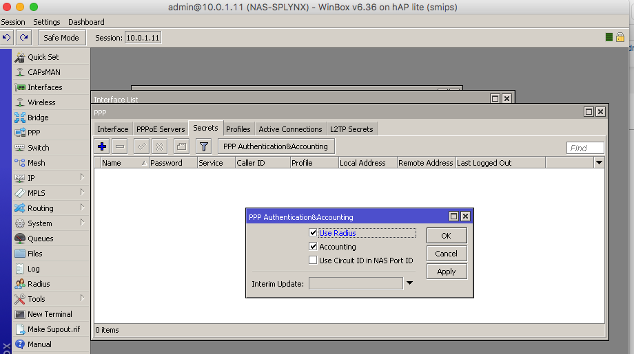
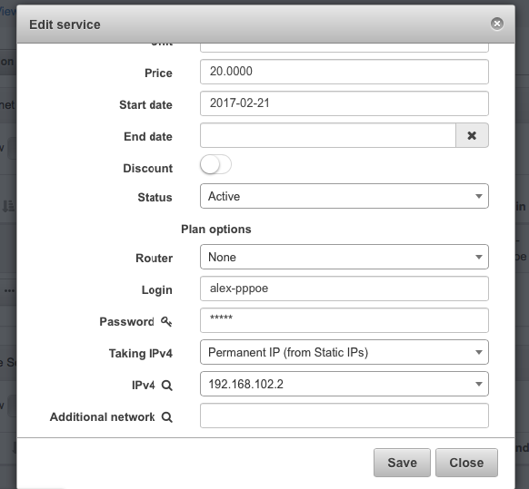
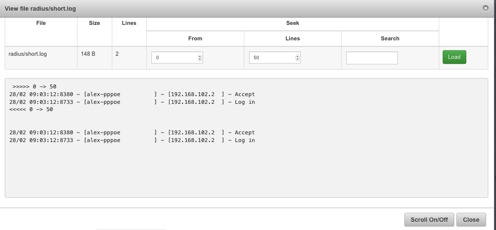
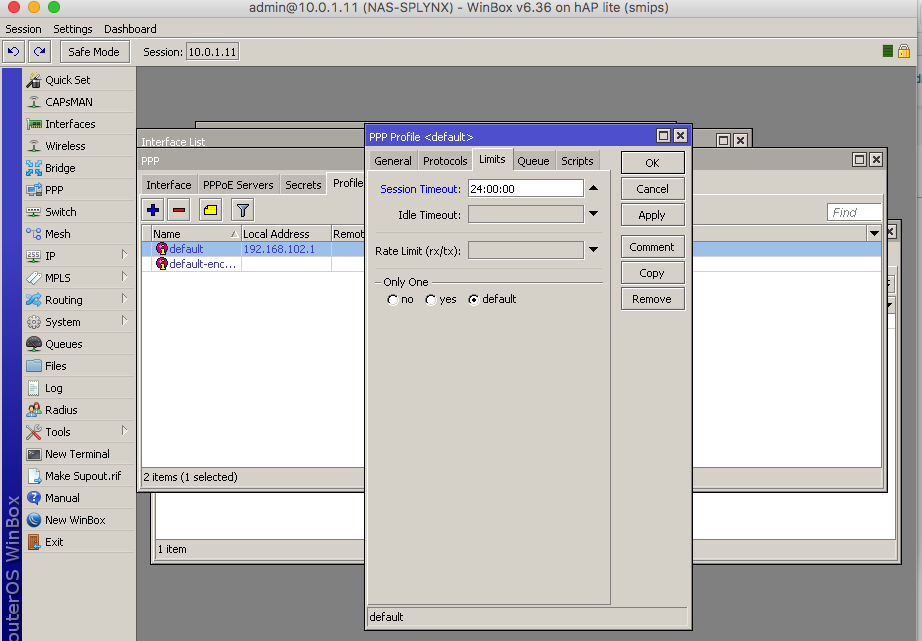
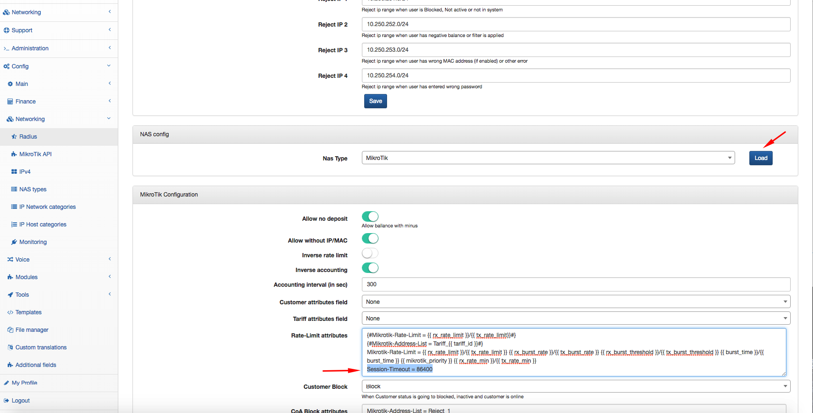

Mikrotik: PPPoE, Radius
==========

The setup shown below is the configuration equivalent for all types of tunnels in Mikrotik that are configured under ppp secrets: ppp, pptp, l2tv, ovpn and pppoe. This particular example illustrates a PPPoE configuration.

There are several areas described in the tutorial:

1. Connecting the Mikrotik router to the Splynx Radius server
2. Customer connection to the router and authentication
3. Disconnecting/blocking of customers from the Radius server
4. Closing PPPoE sessions
5. Setting different values to Radius attributes

### Connecting Mikrotik router to Splynx Radius server

The first step is to add the router to Splynx, Navigte to `Networking → Routers → Add` and fill in the fields with the details of your router as depicted below:

Radius secret - the password for authentication/communication between the Radius server and the router.

IP/HOST - this is the physical IP address from where packets are sent to the Radius server. If the router is behind a NAT, this field should be filled in with the public IP address. The use of a domain name or dynamic DNS entry is permitted here.

NAS IP - the real IP source address for radius packets. It is recommended that in the Radius settings of the Mikrotik router Src. address = NAS IP in Splynx.

The next step is to configure the Radius settings within the router:

Then, define the Interface where the PPPoE server runs:

Enable Radius authentication for the PPPoE server (and other ppp services) in the Secrets tab of your router settings:

A very important step is to define the Local IP address in the ppp Profile. As the local IP of PPPoE server is used for establishing the PPPoE tunnel. The tunnel will not be established without specifying the Local IP and you will get Local IP errors in logs. The Remote IP will be assigned by Splynx Radius server.

### Customer connection to router and authentication

When the router is connected to the Splynx Radius server, we can then add a new customer and create internet service for them within Splynx:

The IP address can be assigned on permanent/static basis by the Splynx Radius or dynamically (every time the customer connects they will receive a different IP from the  pool selected). By default, PPP login's and password's are taken from the main Splynx customer login/password credentials. This can be changed in the service which will make the ppp and Splynx portal login and passwords different:

Now we can connect the CPE or PC of the customer with username: alex-pppoe and password: 12345. All communications between the Splynx Radius server and Mikrotik routers are available in logs under `Splynx → Administration  → Files → Radius` short (radius/short):

For further troubleshooting please visit the  [Troubleshooting Radius server](networking/troubleshooting_radius/troubleshooting_radius.md) page.

### Disconnecting/blocking users from Radius server

When customer's' status is changed from Active to Blocked, the Splynx Radius server pushes the Change of authorization (COA) message to the Mikrotik Router. The COA message contains the name of the address list where the customer's IP should be added to. It does not matter if the customer has permanent or dynamic IP - their current IP address will be put to the address list Reject_1. When we change the status back to Active, the address list Reject_1 is rewritten via the COA message to "Active". The other option to block the customer's session is to use the disconnection of the session. The session is disconnected and when the customer attempts to reconnect, they are added to the address-list (when using permanent IP assignment) or they will receive an IP from a special blocked IP pool (dynamic IP assignment). For both of the types of blocking customer sessions, it is necessary to enable Incoming communication on the Mikrotik Router side:

For more information on blocking customers, please visit our - [blocking users in Splynx](networking/authentication_users/blocking_customers/blocking_customer.md) tutorial page.

#### Closing PPPoE sessions

By default, Splynx does not close the sessions of customers if it is not requested/executed by an administrator. This means that, in the Statistics of a customers a session can remain active for a long time. This can cause misleading information when communicating with customers. To close the session automatically every 24 hours, there is the ability to configure the session timeout in the Mikrotik router settings:

Or add a attribute to rate-limit field within `Splynx → Config → Networking → Radius`

There is also a method in Splynx to close the session of a customer, forcing the customer to reconnect. It is available through the use of the "X" button in the service of the customer or in the table of Online customers but only if the "X" option is added to the list of columns in the table.

Service close session:

#### Setting different values to Radius attributes

In `Config → Networking → Radius` there is a field available for setting additional attributes.

To understand the usage of Radius attributes customization, please, follow the [Radius server customization](networking/radius_customization/radius_customization.md) guide.
