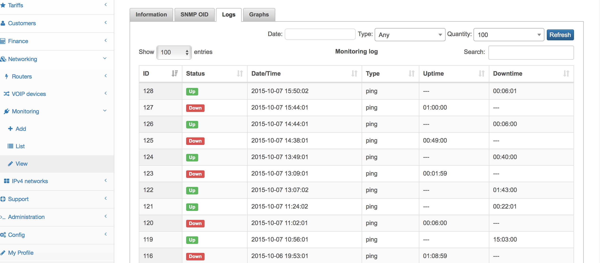
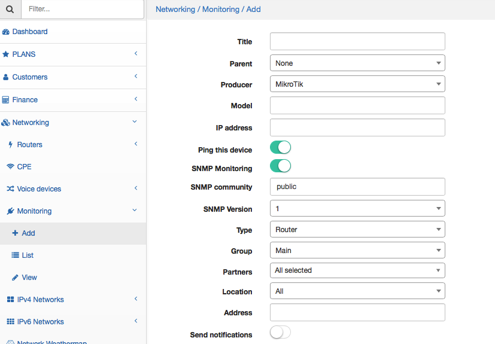
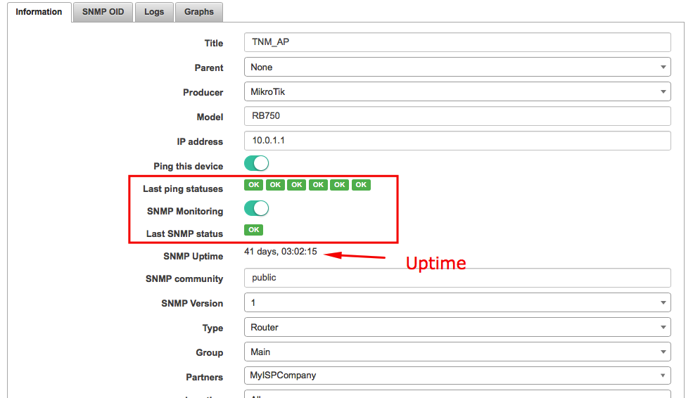
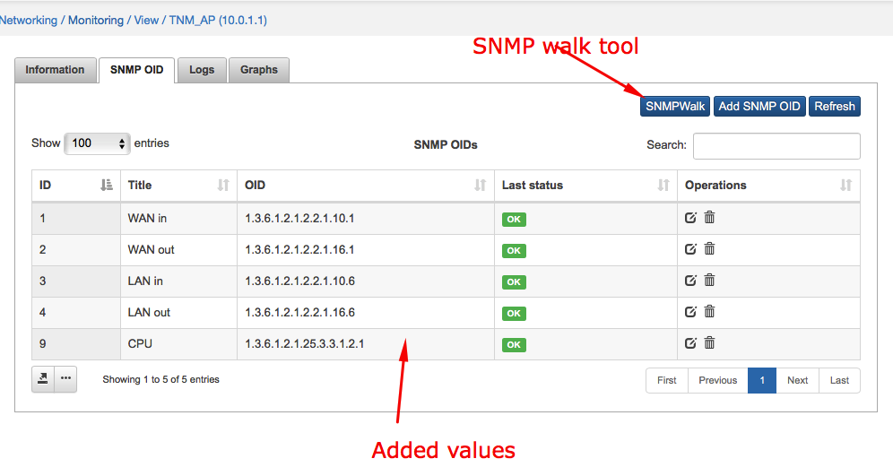
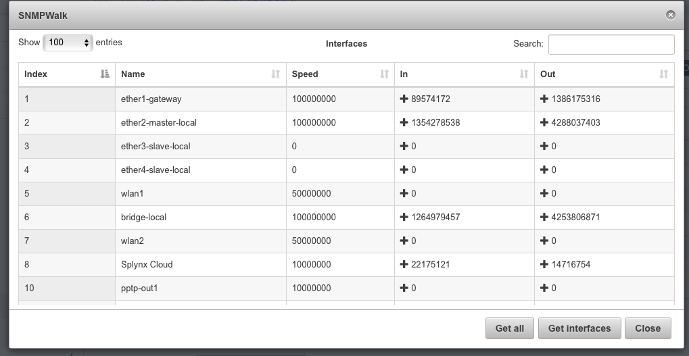
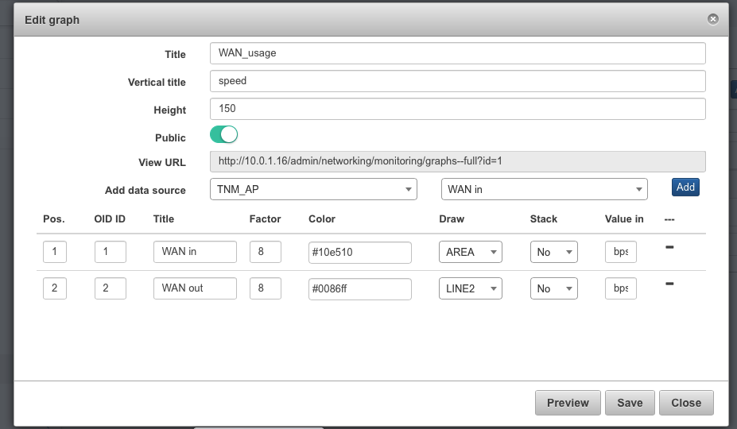
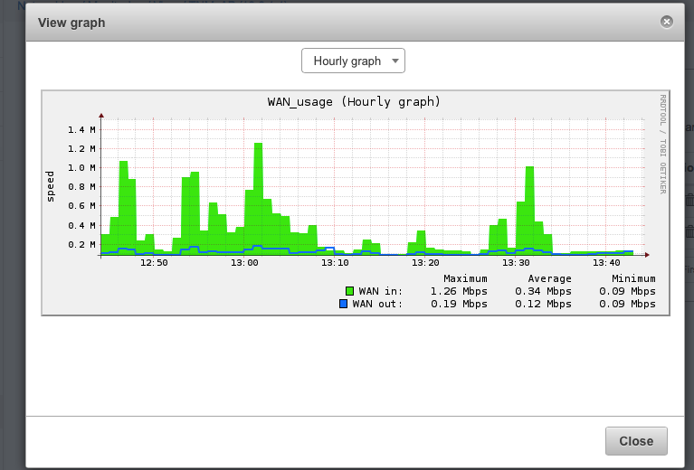
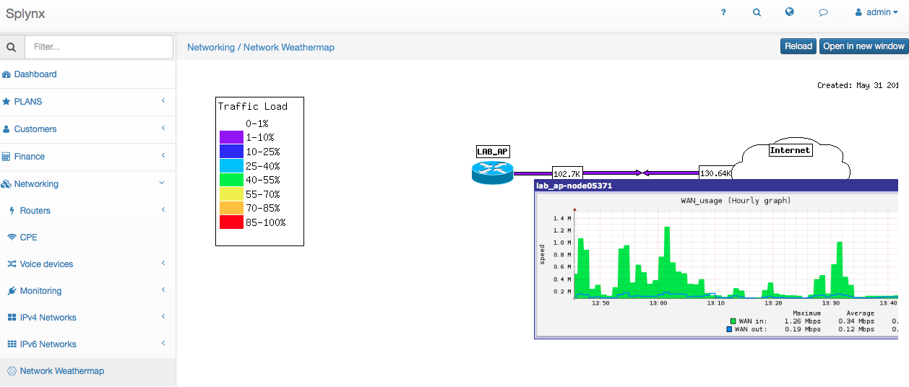
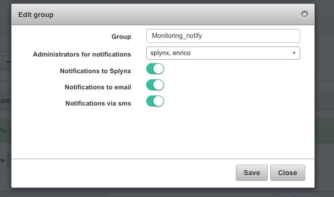

Monitoring
==========

Splynx monitoring is based on SNMP and Ping tools.

The following images displays SNMP logs and RRD charts. We make use of RRD as a technology for data logging and generating charts.

#### How to add a device to monitoring:

Navigate to `Networking / Monitoring` and Add a new device. Please enter the IP address and SNMP community. You can also choose if you would like to receive notifications if the device is down.

* **Title** - name of the device
* **Parent** - you can build parent-child relations in Splynx monitoring
* **Producer** - vendor name
* **Model** - information about the device model
* **IP address** - IPv4 address of the device where SNMP and Ping tools will connect
* **Ping this device** - If enabled, Splynx will send ICMP echo pings to the device
* **SNMP Monitoring** - If enabled, Splynx will connect to the device via SNMP and grab the available information
* **SNMP community** - define a custom community, using "public" is insecure
* **SNMP Version** - we recommend using version 2
* **Type** - router, switch or any other type that is possible to configure in settings
* **Group** - this is an important field as it defines under which group device the device is assigned to. This is used for notification purposes
* **Partners** - defines the partners will be able to see the device in Monitoring
* **Location** - used for searching and listing purposes
* **Address** - information about the address where the device is installed
* **Send notifications** - If enabled,  notifications will be sent according to Group settings

If the device is up and running we should see the information of the device as depicted in the image below:

That was the simple configuration to get the status of a device. We can use SNMP OIDs to get the values and measure hardware components such as CPU performance, Memory usage, Voltage or speed on interfaces. To achieve this, navigate to the SNMP OID tab and use SNMP Walk tool to get the interface list and all available OIDs.

SNMP Walk is a linux tool that Splynx uses to get the available SNMP OID values for configuration. Clicking the "+" button, will add the value for monitoring:

In the example, we have added LAN, WAN and CPU usage as the values to be monitored.

Using these values, we can add charts to Splynx. By navigating to the Graph tab and clicking on the Add graph button:

For the monitoring of speeds on interfaces, it is important to set the field "values in" to bps and set the "Factor" field to 8. This will create charts and use Bits per second. It is also possible choose which type of chart/graph you wish to create (Line, Bold line (LINE2) or Area).

Below is an example of the result of a graph/chart:

Charts and SNMP values from Monitoring can be used in the Splynx Weathermap tool as depicted on the example below:

To configure notifications for monitoring, please navigate to the `Config → Networking → Monitoring` section:

Scroll to the bottom of the page to the Groups section.

Each group has it's members and types of notifications - Email, to Admin portal or SMS.

For a deeper understanding of Splynx monitoring, please view the videos below:

<iframe frameborder=0 height=270 width=350 allowfullscreen src="https://www.youtube.com/embed/2XDbqc7b-cI?wmode=opaque">Video on youtube</iframe>

Ping tools :

<iframe frameborder=0 height=270 width=350 allowfullscreen src="https://www.youtube.com/embed/BebSml0tQ-U?wmode=opaque">Video on youtube</iframe>

CPU usage :

<iframe frameborder=0 height=270 width=350 allowfullscreen src="https://www.youtube.com/embed/jr_HKAT4qHA?wmode=opaque">Video on youtube</iframe>

Memory usage :
<iframe frameborder=0 height=270 width=350 allowfullscreen src="https://www.youtube.com/embed/yIlq_msIpmA?wmode=opaque">Video on youtube</iframe>
