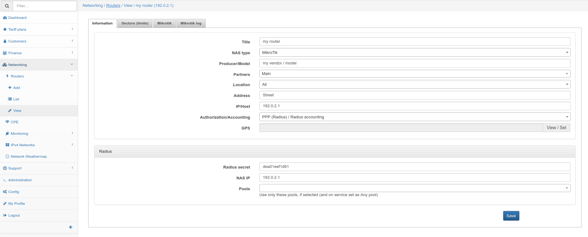
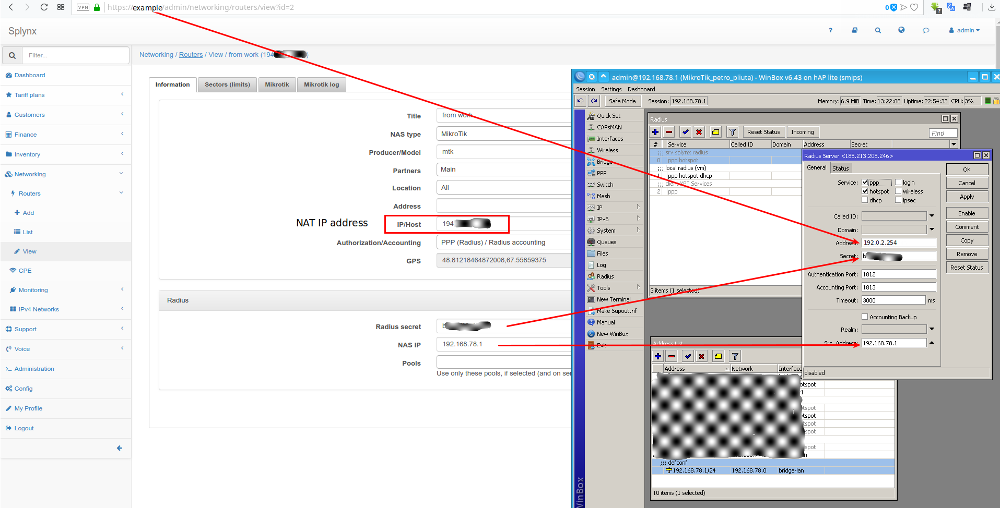

Routers settings
==========

Networking / Routers - is the place where you can add and configure your network routers (Network Access Servers).

<icon class="image-icon"></icon> Please note, if new router is added or configuration is changed - it may take up to 5 minutes to change and apply new freeradius configuration.

**Title** - formal name. Just to distinguish between different routers.
**NAS type** - Type of NAS (Network Access Server). You can configure NAS types under _Config / Networking / NAS types_. The main difference between different NAS types is to use Mikrotik API for this NAS type or not. Also, you can set different settings for different NAS types under _Config / Networking / Radius_.  
**Producer/Model** - just a note for you.  
**Partners** - Partners.  
**Location** - Location.  
**Address** - Postal address (just a note).  
**IP/Host** - Router's IP address, this is the physical IP address from where packets are sent to Radius server (to Splynx). **In case when router is behind NAT, this is the public IP address of NAT device.** Can be set as a domain name or dynamic DNS entry.  
**Authorization/Accounting** - different types of Authorization/Accounting.

*   **None / None** - useful for different not standard scenarios.
*   **None / API accounting** - useful for different not standard scenarios. In addition to previous, Mikrotik API accounting will be used.
*   **Firewall IP-MAC filter / API accounting** - Mikrotik API will be used to push firewall filter rules into router. This is useful for Static IP addresses. When customer sets his/her IP address on the equipment manually.
*   **DHCP (Radius) / API accounting** - DHCP server on the router will use Radius authorization. Accounting will be made with Mikrotik API.
*   **DHCP (Leases) / API accounting** - Mikrotik API will be used to push DHCP leases into router. <icon class="image-icon"></icon> Do not forget to set MAC addresses for internet services. Accounting will be made with Mikrotik API.
*   **PPP (Radius) / Radius accounting** - PPPoE / PPTP / OpenVPN server will use Radius authorization. Radius accounting will be used.
*   **PPP (Secrets) / API accounting** - Mikrotik API will be used to push PPP secrets into router. Accounting will be made with Mikrotik API.
*   **Hotspot (Users) / API accounting** - Mikrotik API will be used to push Hotspot users into router. Accounting will be made with Mikrotik API.
*   **Hotspot (Radius) / Radius accounting** - Mikrotik Hotspot server will use Radius authorization. Radius accounting will be used.

<icon class="image-icon"></icon> Even if Authorization = None or API authorization is used - Radius authorization and Radius accounting will work.  
<icon class="image-icon"></icon> If API Authorization is used - do not forget to choose specific router in internet service settings (with router = None this will not work).  
<icon class="image-icon"></icon> If API Authorization is used - Mikrotik API should be enabled and configured on the _Mikrotik_ tab and in Router settings.

**API ACCOUNTING** - Splynx server from time to time (every 5 minutes) enters to Mikrotik device (via Mikrotik API) and gets statistic.
**RADIUS ACCOUNTING** - Router sends accounting statistic every **n** seconds to Splynx server using RADIUS accounting packets. **n** is configurable value. It can be configured per NAS type under *Config / Networking / Radius / NAS Type/ Load / Accounting interval (in sec)*.

**GPS** - you can put a point on the map (where router is located). This field is available only when Google Maps add-on is installed.  
**Radius secret** - Radius secret.  
**NAS IP** - the real IP source address for radius packets. **It does not matter if router is behind NAT or not.** It's recommended than in Radius settings in Mikrotik router Src. address = NAS IP in Splynx.

**Pools** - if selected, use only selected pools for this router. If you want to use all available pools - do not select any.

* * *

Splynx supports different router models from different producers. Below are configuration tutorials for vendors that are used most often:

* [Cisco routers](/networking/routers_settings/cisco/cisco.md)

* [Juniper routers](/networking/routers_settings/juniper/juniper.md)

* [Mikrotik routers](/networking/routers_settings/mikrotik/mikrotik.md)

* [Ubiquiti Edge routers](/networking/routers_settings/ubiquiti/ubiquiti.md)

* [Other](/networking/routers_settings/other/other.md)
