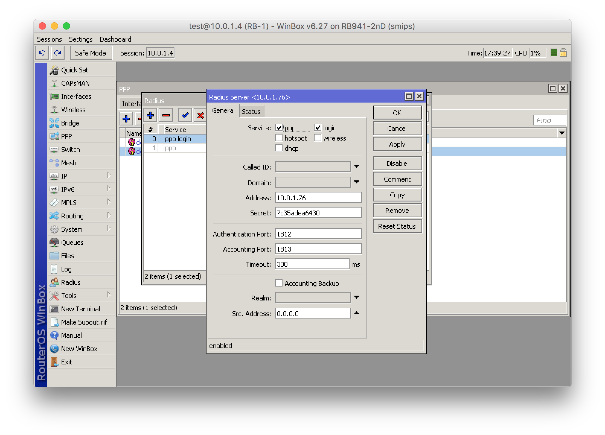
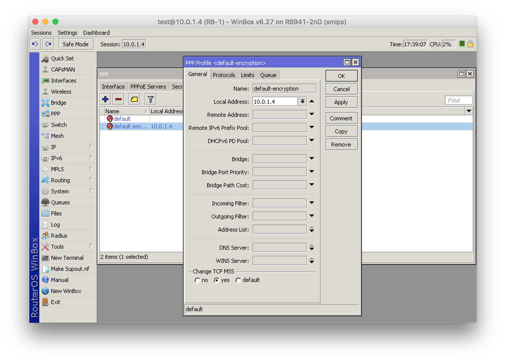
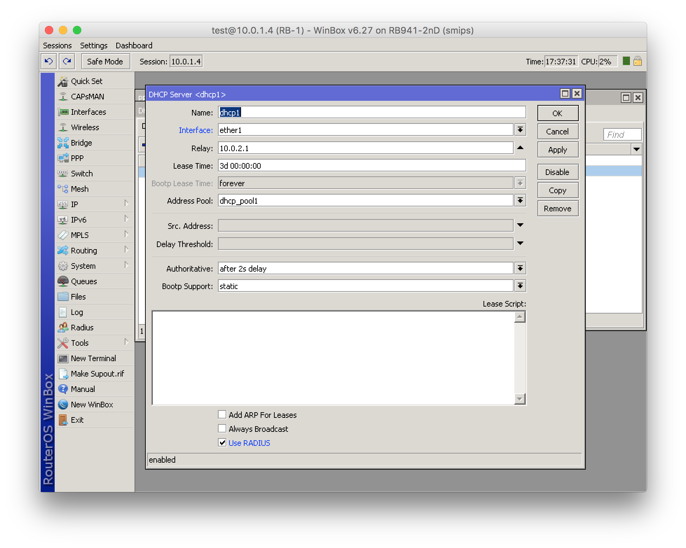
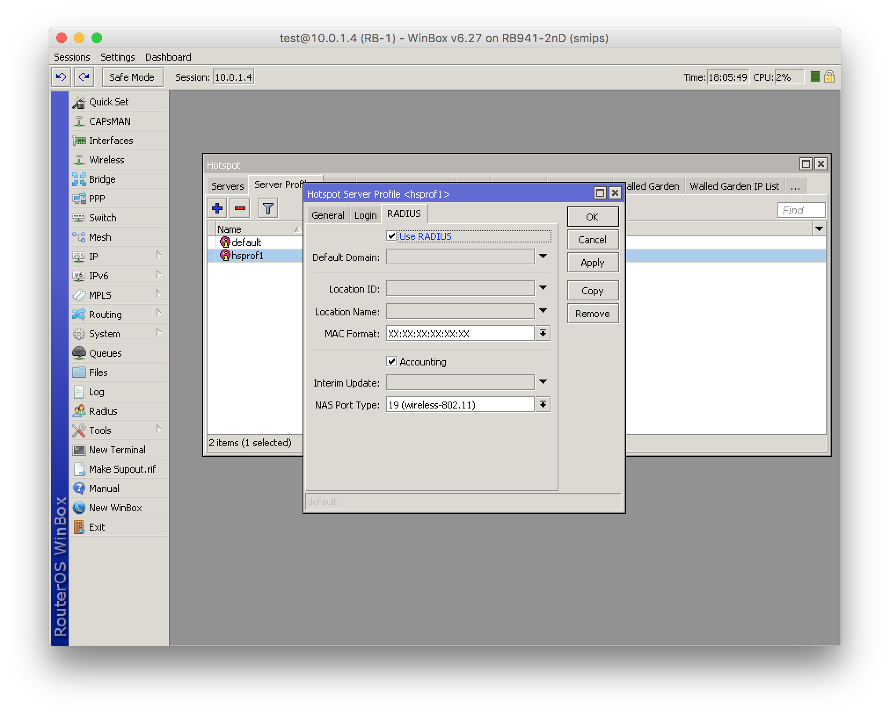
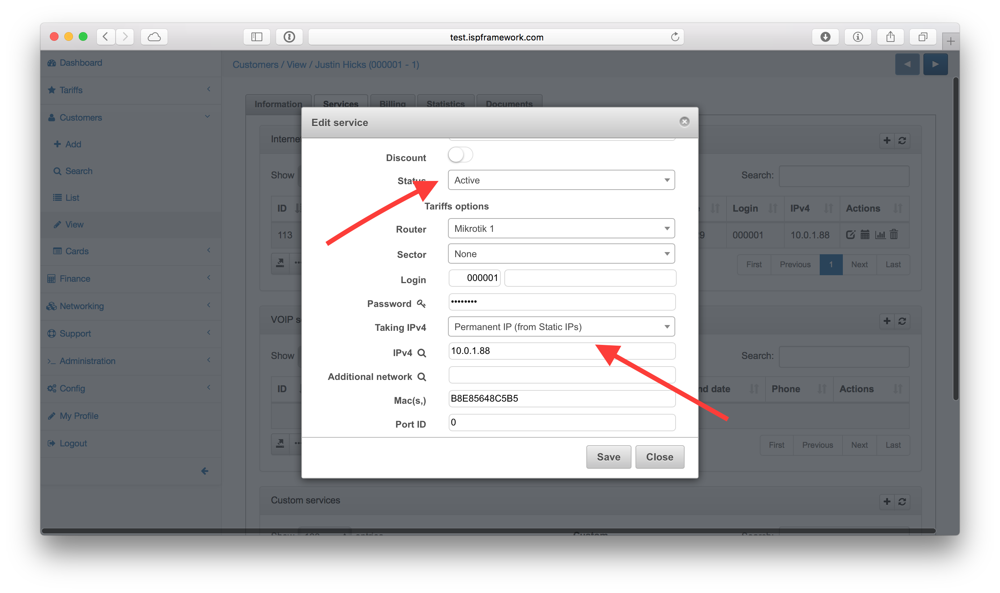

Troubleshooting Radius server
==========

This is a guide illustrating how to troubleshoot communication between your router (Mikrotik example) and the Radius server.

Video tutorials for Radius configuration can be found on the page below:
  https://splynx.com/384/ispframework-and-radius-mikrotik-example/.


The steps below can be used to configure your router and the radius server:

### Mikrotik Radius section
To configure the Mikrotik router and Radius authentication, the following settings should be changed in the Mikrotik Radius section.
1. Choose the services you want to be authenticated by Radius (ppp, DHCP, login etc.)
2. Enter the server IP address = Splynx IP address, reachable from Mikrotik
3. Enter the Radius Secret = this is the value configured in Splynx under `Networking / Routers / View,  Radius Secret`

  

4. We cannot use more than one Radius server per Service

  


### MikroTik PPP (in case if PPPoE is used)
1. In the Secrets tab of the PPP configuration, please enable “Use radius (yes) and Accounting (yes)” for the PPP Authentication & Accounting features.


2. Set the PPP Profile to default or default-encrypted and configure the Local address (this is the IP address of the Mikrotik router for establishing PPP connections)




### MikroTik DHCP

If you intend on using IPoE authentication (DHCP), it is necessary to enable Radius communication on the DHCP server.




### MikroTik Hotspot

To enable Radius hotspot authentication, please change the Hotspot configuration of the Mikrotik router under `IP -> Hotspot` as depicted in the image below:




After we've enabled services for Radius authentication, we can proceed to configure the router within Splynx.


### Splynx router configuration

`Networking -> Routers`, here you can add or edit router settings.
The following fields need to be given special attention as these are the important fields for the successful configuration of your router:
1. Radius Secret - should be the same as in Mikrotik settings
2. IP/Host –  the real IP (or host, or dyndns host) from which Mikrotik sends packets from. If there is a NAT between the Mikrotik and Splynx Radius, the host IP should be the public IP of NAT router and the real IP will be the private IP of Mikrotik router.
3. Authorization/Accounting – select an authentication method between DHCP, PPP or HotSpot Radius authentication. Please note, radius authentication runs actively in the background on Splynx - this is especially useful because you can select an API method of authentication/accounting like DHCP (which requires API accounting as Mikrotik doesn't support Radius accounting via DHCP). In this case, the Mikrotik API will be used to login to the router to retrieve the accounting statistics for all customers. All services using radius authentication and accounting will work regardless of the authentication method chosen on Splynx as long as they are enabled in the Radius config of the router.
4. NAS IP – IP address of the router (on the radius packet – NAS-IP-Address), if you are using the hostname of your router, it is necessary to set the physical IP address, which you have configured on your Mikrotik router as the – Radius – Src. Address)


### Define IP networks for IP assignments

` Networking -> IPv4 networks`

Add networks to use for dynamic assignment (pool) or permanent (static) IP assignments


### Activate the customer and configure the Internet service

After have added the router and networks to Splynx, we can proceed to add and activate a customer.


Thereafter, we need to create an Internet service for the customer with the PPP details (or MAC when using DHCP authentication), IP address and other details.



Once all these steps have been completed and the Mikrotik router still shows Radius timeout in the logs, Below is a guide for quick troubleshooting.


### Troubleshooting

First of all, check the file within Splynx logs called `radius/short.log`. Which can be found in `/var/www/splynx/logs/radius` on CLI or via the web interface, navigate to ` Administration -> Logs -> Files`.

The file will display records as shown below:
```
28/02 14:54:16:7361 - [Login               ] - [10.2.32.109    ] - Accept
28/02 14:54:23:3637 - [C38F676DB15B        ] - [10.2.36.0      ] - Log in
28/02 14:54:18:6727 - [C38F676DB15B        ] - [10.2.33.190    ] - Log off -  (NAS-Error)
28/02 14:54:19:3702 - [26117AB65E2B        ] - [10.2.36.0      ] - Log off -  (Session-Timeout)
28/02 14:54:22:7030 - [-Unknown-           ] - [10.250.74.24   ] - Reject (ATTR + IP accept) - [26117AB65E2B] -> [service1] Customer not found
28/02 14:54:23:2525 - [26117AB65E2B        ] - [10.2.33.190    ] - Reject (Attribute accept) - [FCACAF943B30] -> [service1] Customer is not active
28/02 14:54:14:2384 - [user                ] - [10.2.36.247    ] - Reject - [B4FBE4ACFCC2] -> [service1] Customer is already online
28/02 14:54:21:2743 - [265798031           ] - [               ] - [card] Accept
28/02 14:54:21:5017 - [265798031           ] - [10.5.28.211    ] - [card] Log in
28/02 15:10:35:6518 - [voucher-login       ] - [10.1.0.202     ] - [card] Log off -  (User-Request)
28/02 15:11:05:2315 - [serieALRClM4sj      ] - [               ] - Reject card - [4FFE0CD555D3] -> [hap-liter] Password is incorrect
```
Descriptions of records:
* **Accept** - The Splynx server received the Radius Access Request packet from the Router and a Radius Access Accept packet was sent back. Customer was successfully authenticated.
\* Please note, if MS-CHAP is used for authentication, we can see `Accept` here even if password is incorrect.
* **Log in** - The Splynx server received the Radius Accounting Start packet from Router.
* **Log off** - The Splynx server received the Radius Accounting Stop packet from Router.
* **Reject** - The Splynx server received the Radius Access Request packet from Router and Radius Access Reject was sent back. Customer was not authenticated.
* **Reject (Attribute accept)** - The Splynx server sent the Radius Access Accept packet to Router with the IP address from the Splynx service. Customer was authenticated on the router with a session time limit = *Config / Networking / Radius / Error session time limit*. IP address was added into the Address list `Reject_x` on the router.
* **Reject (ATTR + IP accept)** - The Splynx server sent the Radius Access Accept packet to the Router with an IP address from the Splynx Reject pool (*Config / Networking / Radius / Reject IP x*). Customer was authenticated on the router with session time limit = *Config / Networking / Radius / Error session time limit*. IP address was added into the Address list `Reject_x` on the router.
* **\[card\] Accept** - The same as **Accept** but for Prepaid vouchers.
* **\[card\] Log in** - The same as **Log in** but for Prepaid vouchers.
* **\[card\] Log off** - The same as **Log out** but for Prepaid vouchers.
* **Reject card** - The same as **Reject** but for Prepaid vouchers.

In the case of authentication errors or logging off, the reasons are shown in the radius logs under `Administration / Logs / Files / radius short log`.

---

If `radius/short.log` is empty or does not provide enough information, the Radius server should be set to debug mode.

The Splynx Radius server consist of 2 daemons – splynx_radd and freeradius. Both of them have different debugging and show different information. Let’s start with the splynx_radd debugging:

To enable debug mode of splynx_radd, navigate to *Config / Networking / Radius extended* and enable debug into the file:


Then wait for a few minutes until the new settings are applied or you can apply the new settings immediately by restarting the Radius server.
To restart the Radius server, use the button at the bottom of the page (*Config / Networking / Radius extended*), or execute the follwing command in SSH:
```
service splynx_radd restart
```

Now we can check the debug file again, the file is accessible from CLI of the Splynx server:
`/var/www/splynx/logs/radius/debug.log`

The best way to check the file is with the following command:
```
tail -f /var/www/splynx/logs/radius/debug.log
```

If the splynx_radd debug doesn’t show us anything, we can try to run the freeradius daemon in debug mode and see if any packets are received by the Radius server.

Run the following commands in CLI:
```
service freeradius stop; freeradius -Xxxx
```
then check the CLI console output.


If you don’t see any debug messages when a customer tries to connect to the Mikrotik Router, this means that your router cannot send packets and connect to the Radius server at all. Indicating that you have to verify your networking, routing and NAT settings of the network.

On the Mikrotik Router there is also the ability to run extended debug to see what exactly the router is sending to the Radius server:


