Safaricom M-PESA
================

**Safaricom M-PESA** is a Splynx add-on which allows to pay via [Safaricom](https://www.safaricom.co.ke).

## Installation

To install "Safaricom M-PESA" add-on please enter these commands:

```bash
sudo apt-get update
sudo apt-get install splynx-safaricom-mpesa
```
or you can install it from Web UI:

*Config -> Integrations -> Add-ons*:


## Configuration

After installation you should configure it. Go to **Config / Integrations / Modules list / Splynx Safaricom M-PESA**

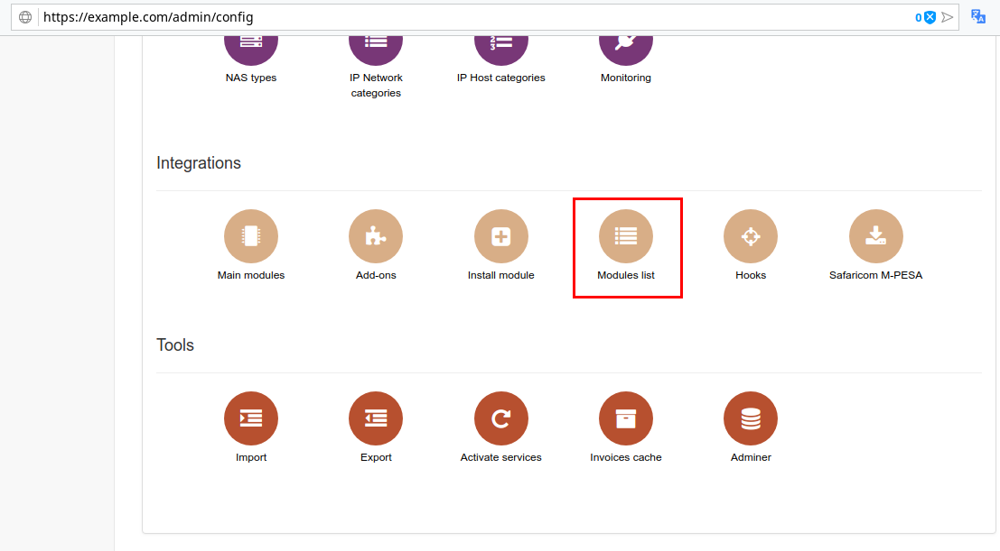
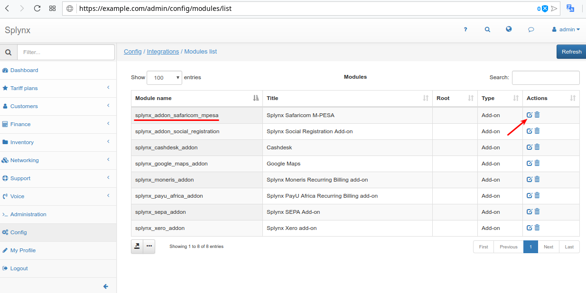

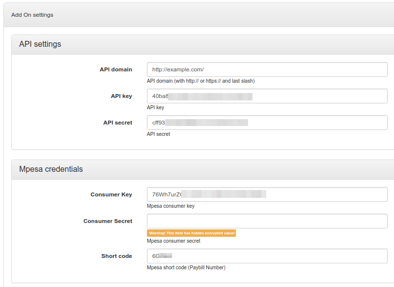
**API domain** - URL of your Splynx server.
**API key**, **API secret** - default values. You can change them only if you know what you are doing.  
**Consumer Key**, **Consumer Secret**, **Short code** - you should [register your M-PESA account](https://www.safaricom.co.ke/personal/m-pesa/getting-started/register-for-m-pesa). After registration you can get these values from MPESA.

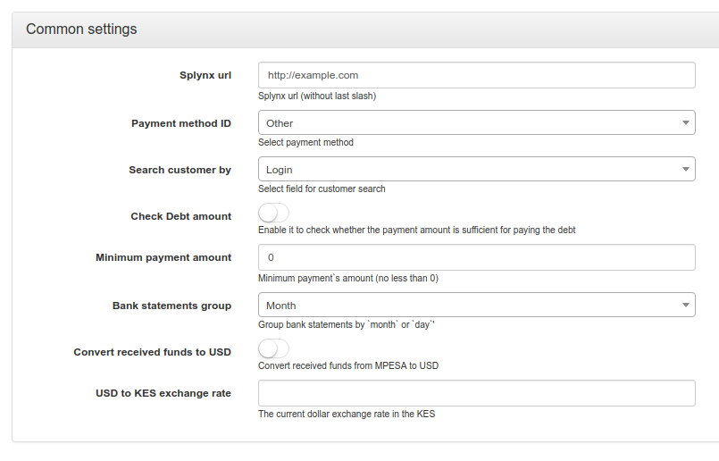

**Splynx url** - URL of your Splynx server.
**Payment method ID** - add-on payments will be made with this [payment method](configuration/finance/payment_methods/payment_methods.md)
**Search customer by** - what will be used to search for the customer in Splynx (during payment). **Login**, **M-PESA Phone** or **BillRefnumber**.

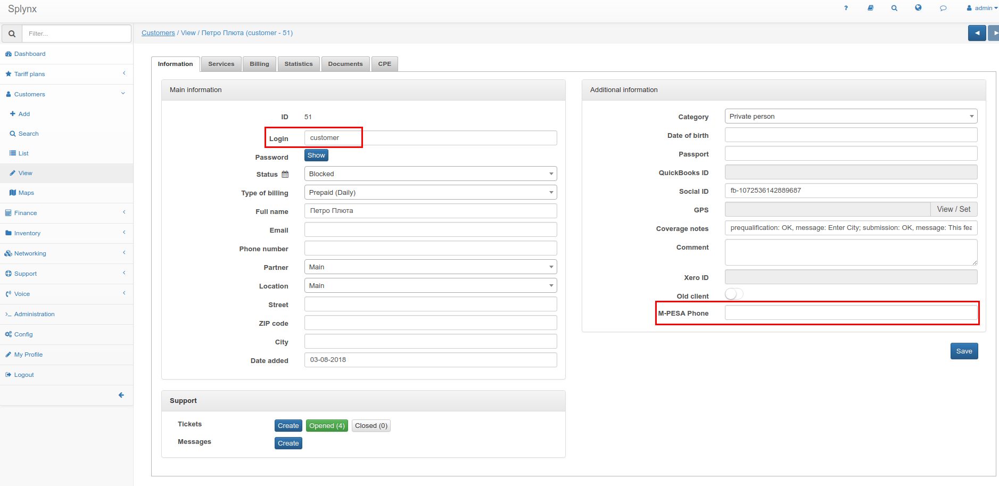

**BillRefnumber** - invoice number:  


**Check Debt amount** - if enabled and the customer's deposit is less than 0, the payment amount must be equal to or larger than the customer's debt.
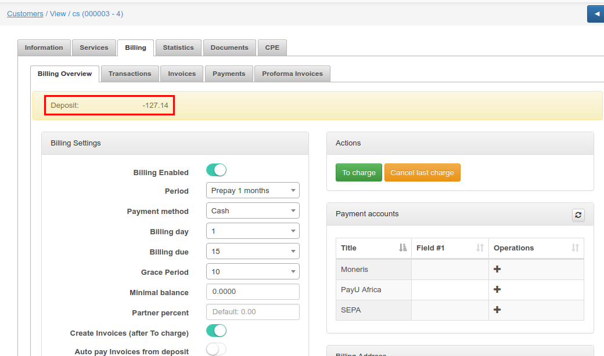

**Minimum payment amount** - the payment amount must be larger than this value.
**Convert received funds to USD** - convert received payment from Kenyan shilling to USD. Enable if you use USD in Splynx.
**USD to KES exchange rate** - internal Splynx exchange rate.  
**Bank statements group** - Group bank statements (**Config** / **Finance** / **Bank Statements** / **History**) monthly or daily.

## URL registration

After configuration you should register your URL at the **Config / Integrations / Safaricom M-PESA**
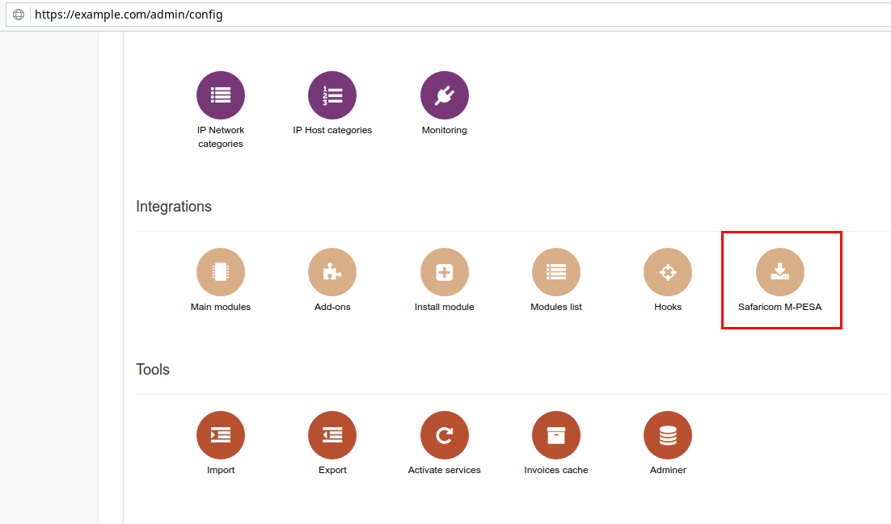


## Payment process

In this example customer pays via SIM menu.

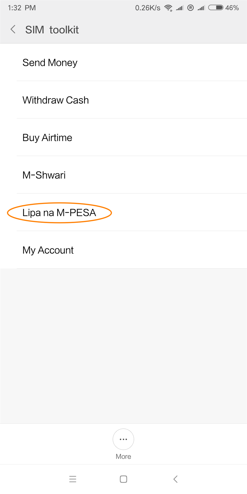 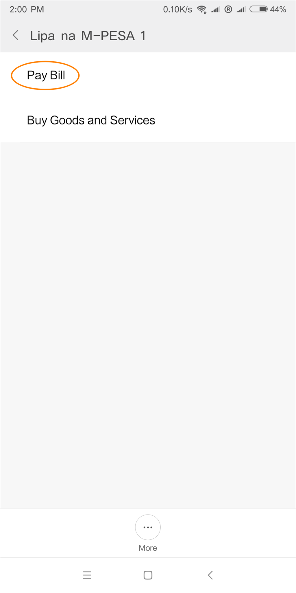  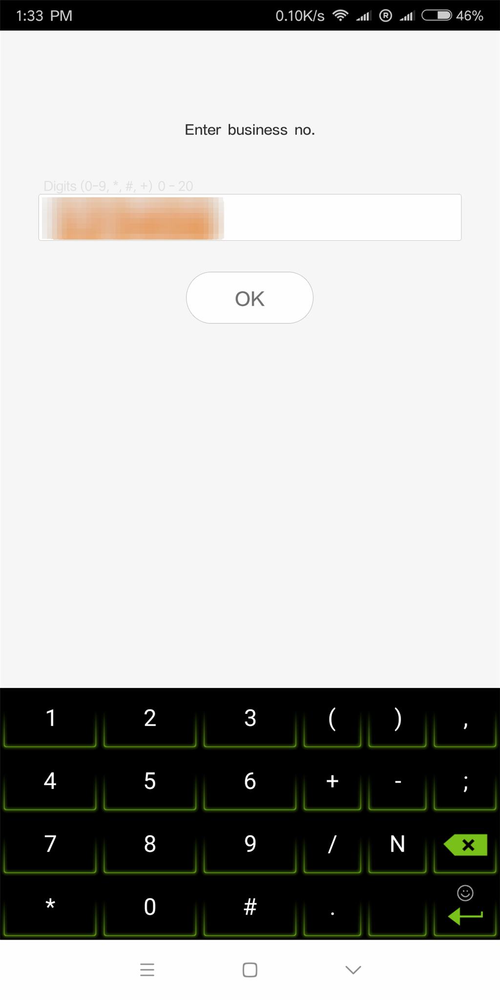

**Business no.** – Mpesa short code (Paybill Number). This is the same as **Config / Integrations / Modules list / Splynx Safaricom M-PESA / Short code**

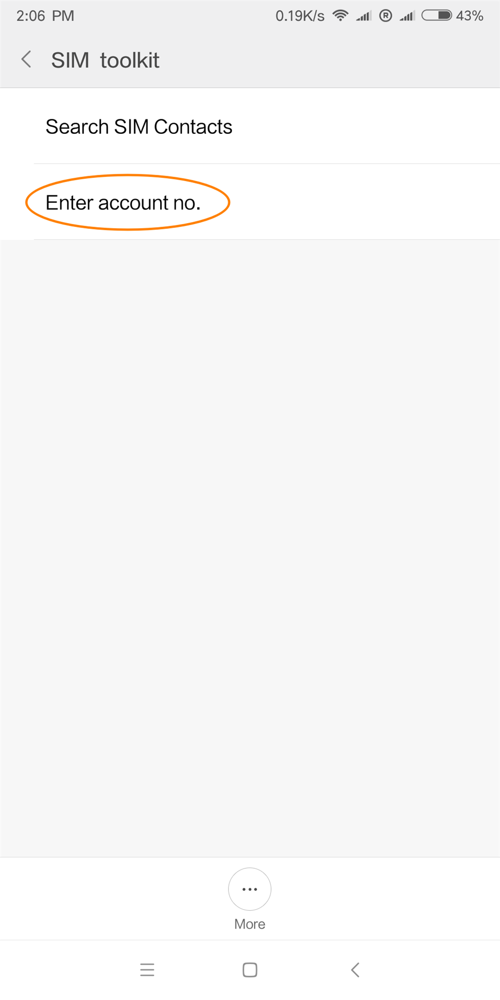 

**Account no.** – this value will be sent to Splynx and depending on what is chosen in **Config / Integrations / Modules list / Splynx Safaricom M-PESA / Search customer by**, customer will be found.

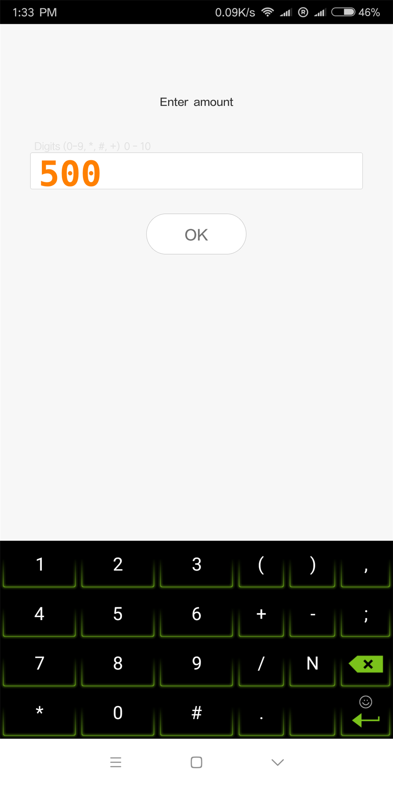 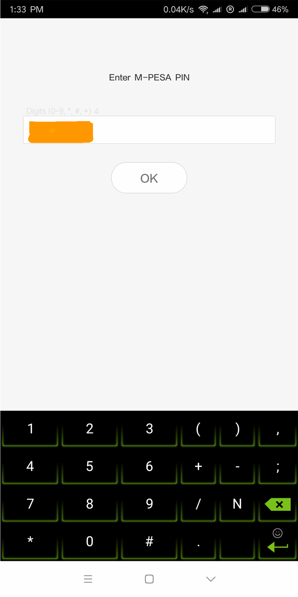

After payment, customer receives SMS:

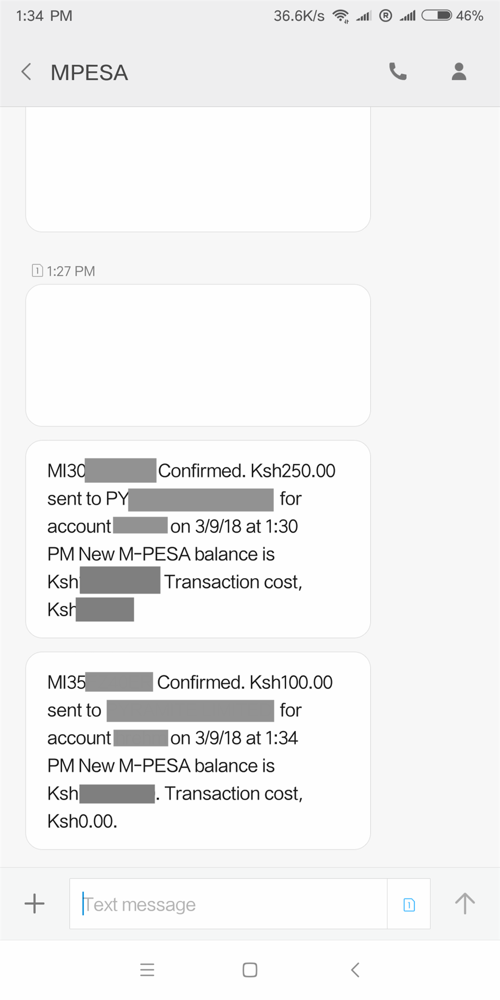

His payments appears in Splynx:


## Safaricom M-PESA account

### Paybill Application

Here are the requirements to use Paybill - [https://www.safaricom.co.ke/personal/m-pesa/lipa-na-m-pesa/paybill](https://www.safaricom.co.ke/personal/m-pesa/lipa-na-m-pesa/paybill)

Kindly note that currently Splynx supports only **paybill** option as the Payment option and does not support a **Till Number**.

After the Paybill application and approval, you need a developers account at the official M-Pesa Daraja Portal in order to integrate the Customer to business API. (C2B)

### Daraja Portal

This is the official M-Pesa Portal that is used to host your application.

Sign up to the Portal.

You need to register an account either as an individual or as a company.

To register follow this link - [https://developer.safaricom.co.ke/login-register](https://developer.safaricom.co.ke/login-register)

An account activation link is sent to the email, used to create the account; this link expires in 24 hours.

### Create a test app in Sandbox

Sandbox is a testing environment. You can use it to test your app before going to production.

Daraja API documentation - [https://developer.safaricom.co.ke/docs](https://developer.safaricom.co.ke/docs)

Splynx Safaricom M-PESA add-on uses a C2B API. Documentation gives a brief description how to test this C2B API.

Create an app by adding app name and select product (C2B).

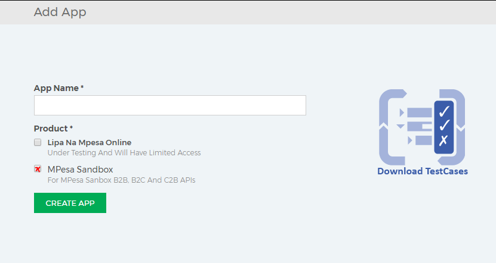

The App contains the following tabs:


* **Keys** – Splynx add-on requires a **Consumer key** and **secret** from this tab.
* **Products** – Shows the approval status of your application API products.
* **Details** – The details tab gives you a summary of your app and the terms and conditions.

The sandbox app is just used to test API calls, made for each different scenario. Test results are put into testcase documents, which are excel documents that can be downloaded from the M-PESA portal.  
(Safaricom doesn’t really validate these test cases but it’s important to fill in “Success” results for Authentication, c2b simulation, registering callbacks and reversal)

### Going live

This step involves moving your application into production.

* After the going on process, a new app is created with new credentials.
* We use these live credentials to configure the M-PESA add-on in Splynx.
* Kindly note that after going live and configuring the Module, Splynx registers your callback URLs automatically.

Requirements:

1. Test cases results – this is an excel document with results from your test scenarios.  

    
2. Shortcode – This is the Paybill number you are using.

3. Business Admin/business manager – These are admin users, with Business Administrator or Business Manager roles on the M-PESA portal.
   

Operator


### M-PESA web portal

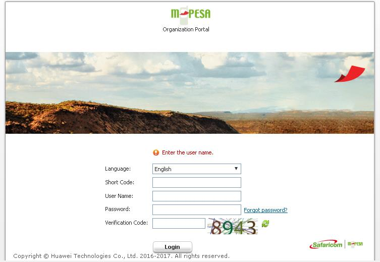

This is another M-PESA portal, where your app is hosted. It can be found on [https://org.ke.m-pesa.com](https://org.ke.m-pesa.com)

<iframe frameborder=0 height=270 width=350 allowfullscreen src="https://www.youtube.com/embed/wQyBkJDsmuw?wmode=opaque">Video on youtube</iframe>

### Requests to M-PESA support team

#### External Validation

* External Validation is disabled by default; this means that M-Pesa is incharge of validating all payments requests to your Paybill.
* M-Pesa servers will accept any payments request, as long as the MSISDN (phone number) is allowed to use M-Pesa services.
* This means that no transaction details are sent to the Splynx server.
* To enable external Validation, you are required to send an Email letter to [M-PESABusiness@Safaricom.co.ke](mailto:M-PESABusiness@Safaricom.co.ke) The email should be sent from the email address used to create an account at the Daraja Portal.

#### Business manager / administrator

* To create a Business Manager / administrator you need a Logging credentials to access [https://org.ke.m-pesa.com](https://org.ke.m-pesa.com)
* One is required to send an email to M-Pesa support requesting creation of a System admin.
* The Email should be in form of a scanned letter on the company letter head, signed by two signatories and bearing the organization stamp.
* Also attach the administrator’s scanned ID copy on both sides.
* The letter should have the following detail:
  * Organization Name
  * Organization Short code
  * First Name
  * Middle Name
  * Last Name
  * Id type (National Id, passport)
  * Id/pp Number
  * Nationality
  * Date of Birth
  * Phone number
  * Administrators User Name
  * Email

This is Email is also sent to [M-PESABusiness@Safaricom.co.ke](mailto:M-PESABusiness@Safaricom.co.ke).

#### Re-registering callbacks

* After URL registration, it’s important to note that you cannot re-register new ones without deleting the previous.
* Since there is no API to delete callback URLs, you are required to write an official letter to M-PESA support team requesting them to delete the URLs.
* The letter should be on the company letter head and should include:
  * Old URLs you want to delete.
  * The new URLs you need to register.
  * Shortcode – Paybill Number.

This is Email is also sent to [M-PESABusiness@Safaricom.co.ke](mailto:M-PESABusiness@Safaricom.co.ke).

#### Nota Bene

* Any request made to M-Pesa support team should be sent via the email used in the Paybill application process.
* M-Pesa will not take into action any request sent to them without verifying ownership of the Paybill Number.
* Every Email sent must include the Paybill Number and Organization Name as registered during application.
