Splynx High Availability setup
==============================

Splynx High Availability setup allows you to use Splynx in Virtual Machine on a group of physical servers. We will call this group of servers - ‘cluster’ and every server we will call - ‘node’  
We use [Proxmox Virtual Environment](https://pve.proxmox.com/wiki/Main_Page) with [Ceph](https://ceph.com/) in this tutorial.

Requirements:

* at least three servers
* two storage drives on each server (one for system and one for Ceph)
* all servers must be in the same network
* two network interface controllers for each server (one for Ceph)

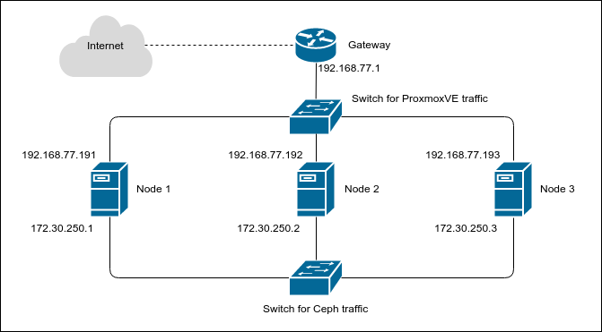
Figure 1\. Network diagram

## Install Proxmox

Install Proxmox to all nodes  
Download installation ISO from [https://www.proxmox.com/en/downloads/category/iso-images-pve](https://www.proxmox.com/en/downloads/category/iso-images-pve)  
Burn it to CD or create bootable Flash USB drive

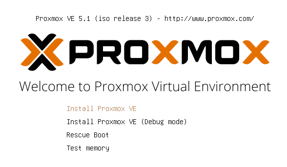
***
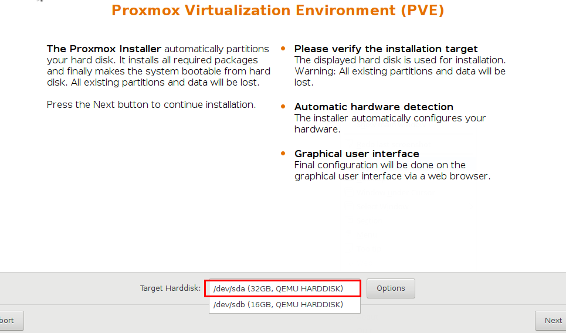
***
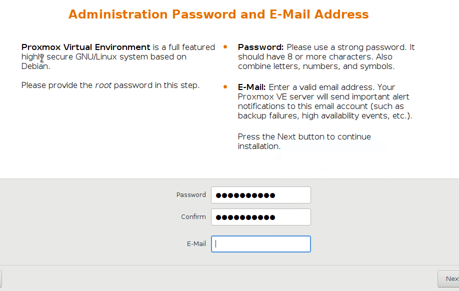
***
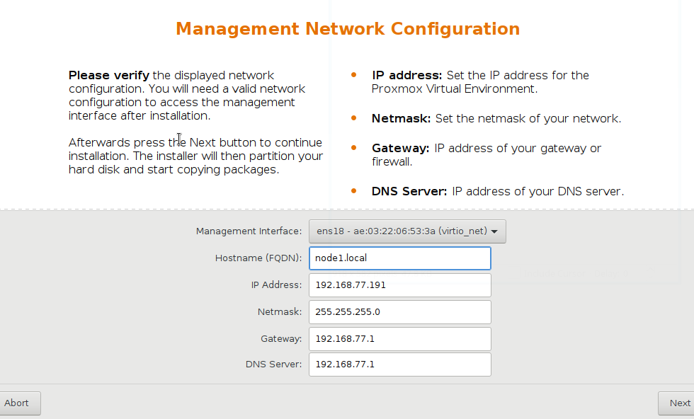
***
Hostname and IP Address must be different on different nodes
***
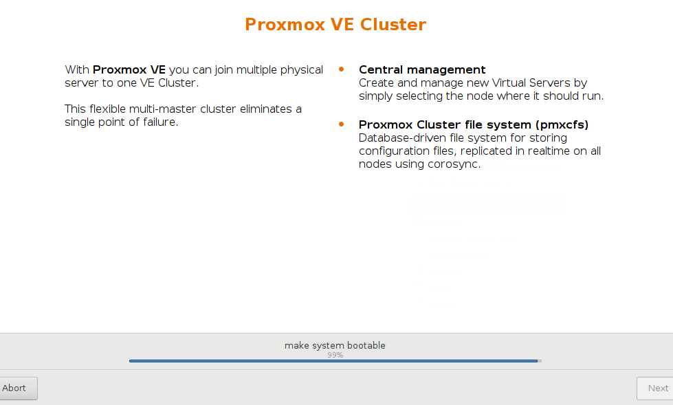
***
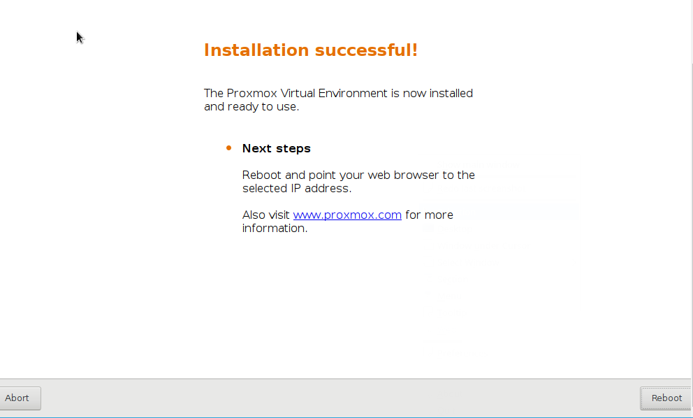
After installation – remove Proxmox CD (Flash drive)

Reference: [https://pve.proxmox.com/wiki/Installation](https://pve.proxmox.com/wiki/Installation)

## Upgrade nodes

Disable the enterprise repository that is configured by default, add the no-subscription repository.  
Edit _/etc/apt/sources.list.d/pve-enterprise.list_:

```bash
#deb https://enterprise.proxmox.com/debian/pve stretch pve-enterprise
deb http://download.proxmox.com/debian stretch pve-no-subscription
```

Run in shell (on each node):

```bash
nodeX> apt-get update && apt-get -y dist-upgrade
```

Reboot nodes after upgrade.

## Cluster

We must merge all nodes into one cluster. Make sure that each node is installed with the final hostname and IP configuration. Changing the hostname and IP **is not possible** after cluster creation.  
Run in shell on the first node:

```bash
node1> pvecm create splynx-cluster
```

where ‘splynx-cluster’ – is the name of cluster. Can be any.

Add the rest nodes to the cluster.
On every node run:

```bash
node2> pvecm add IP-ADDRESS-OF-NODE1
```

```bash
node3> pvecm add IP-ADDRESS-OF-NODE1
```

Reference: [https://pve.proxmox.com/wiki/Cluster_Manager](https://pve.proxmox.com/wiki/Cluster_Manager)

## Ceph

Ceph is a network-based file system. Ceph replicates data and makes it fault-tolerant. Your data will be in safe even if one (or more) servers will fail. This articles describes how to setup and run Ceph storage services directly on Proxmox VE nodes.

Install Ceph to each node:

```bash
node1> pveceph install
```

```bash
node2> pveceph install
```

```bash
node3> pveceph install
```

We use separated NICs and sepatated IP network for Ceph traffic.
Part of _/etc/network/interfaces_:

```bash
auto ens19
iface ens19 inet static
address 172.30.250.1 #(172.30.250.2 – on 2nd node, 172.30.250.3 – on 3rd node)
netmask 255.255.255.0
```

After editing _/etc/network/interfaces_ - reboot node to apply changes.

Create an initial Ceph configuration on just one node:

```bash
node1> pveceph init --network 172.30.250.0/24
```

This creates an initial config in /etc/pve/ceph.conf. This file is automatically distributed to all Proxmox VE nodes.

If you get error message like this:  
`unable to open file '/etc/pve/ceph.conf.tmp.12688' - Permission denied`
Reboot your nodes and try again.

Create Ceph monitors on all nodes:

```bash
node1> pveceph mon create
```

```bash
node2> pveceph mon create
```

```bash
node3> pveceph mon create
```

Erase partition table of Ceph drive(s) and create OSD(s) on it. Run on each node:

```bash
nodeX> ceph-volume lvm zap /dev/sdb --destroy
nodeX> pveceph createosd /dev/sdb
```
*We use /dev/sda for system and /dev/sdb for Ceph in this tutorial

Create Ceph pool.  
Run on one node:

```bash
node3> pveceph createpool default-pool -add_storages true
```

This creates pool with name ‘default-pool’ and adds storages for VMs and containers to it. Pool name can be any.

Reference: [https://pve.proxmox.com/wiki/Ceph_Server](https://pve.proxmox.com/wiki/Ceph_Server)

## Create VM

Open your web-browser and type [https://IP-OF-ANY-NODE:8006](https://IP-OF-ANY-NODE:8006). If you get certificate error – just ignore it (add to exceptions).

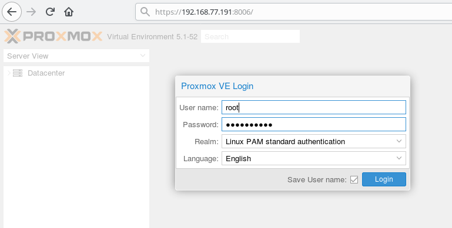

User name: root  
Password: the password you have entered during installation.

We will install Ubuntu-16.04-server. [Download](https://www.ubuntu.com/download/server) ISO image to PC. Then upload it from PC to local storage of one of Proxmox nodes:

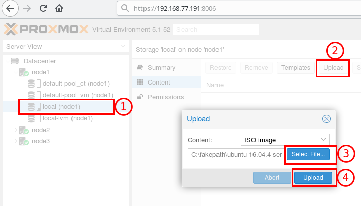

Create VM on the node:

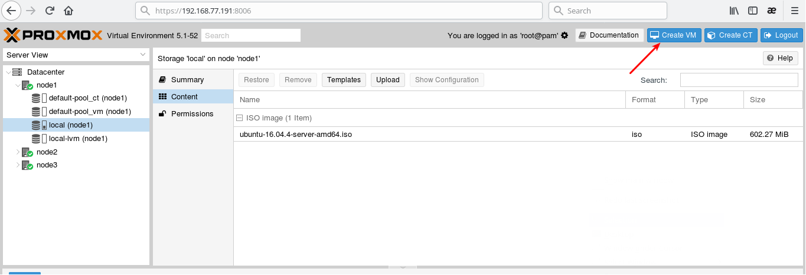

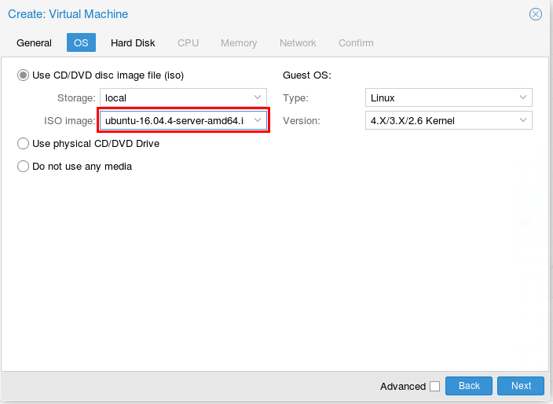

Use Ceph storage for VM:

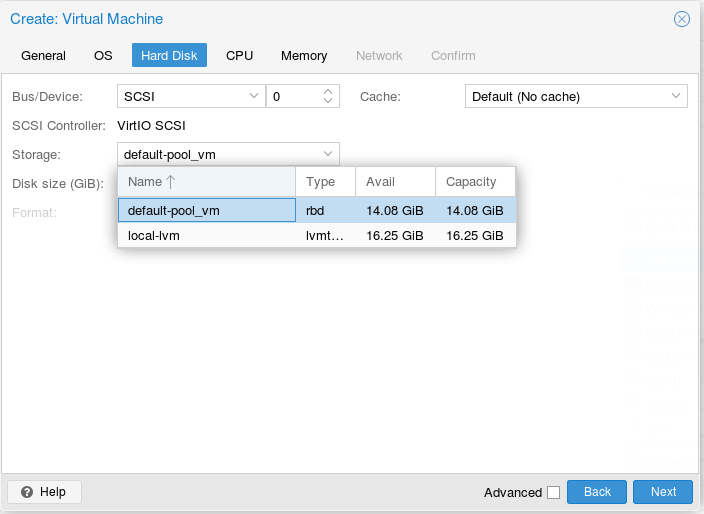

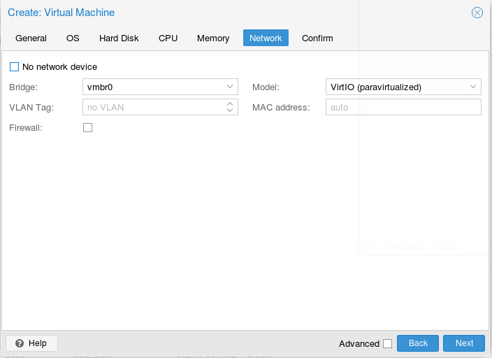

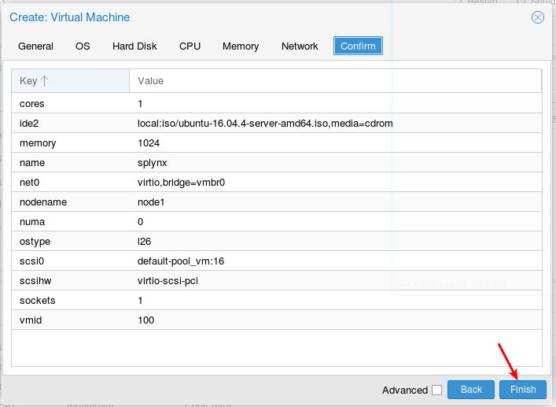

## Install Linux

Start VM, open Console and install Linux as usual:

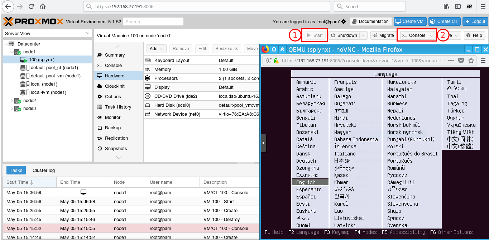

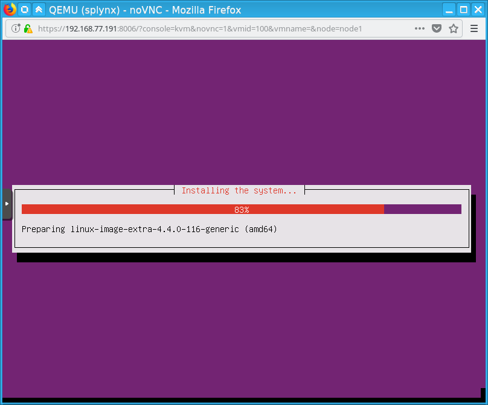

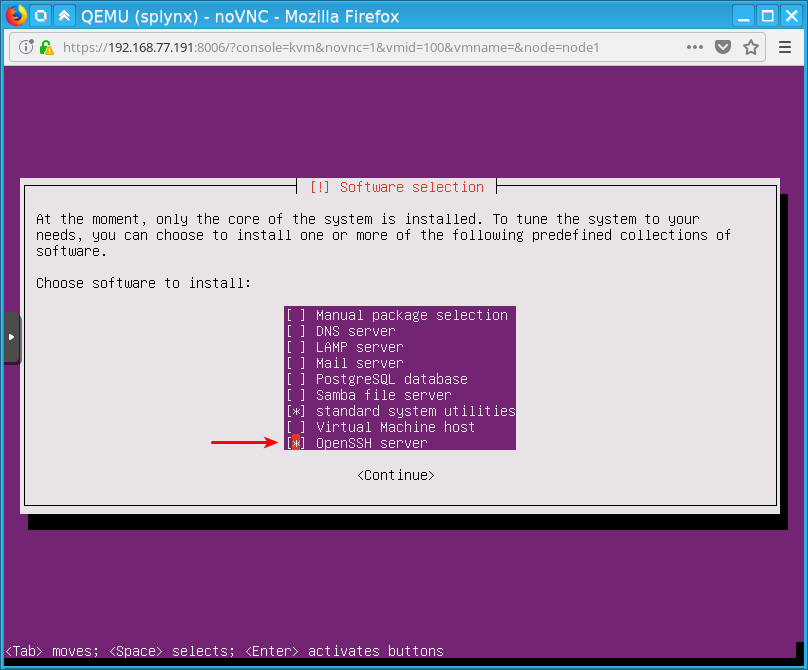

Remove ISO from VM:

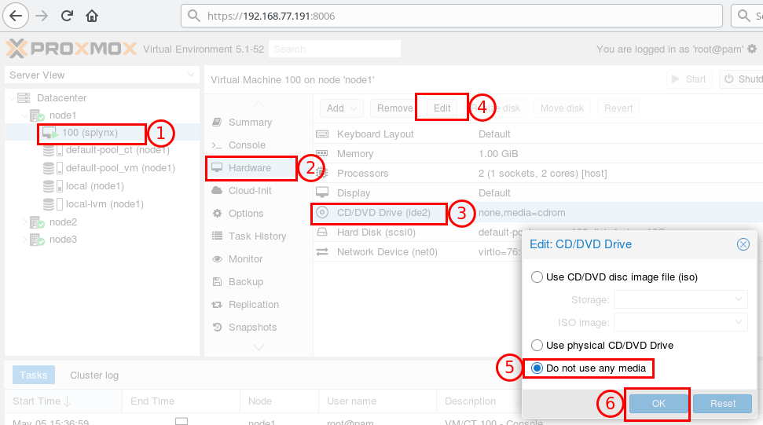

Restart VM:


Let’s find IP address of VM. Open Console, log-in and type `ip a`

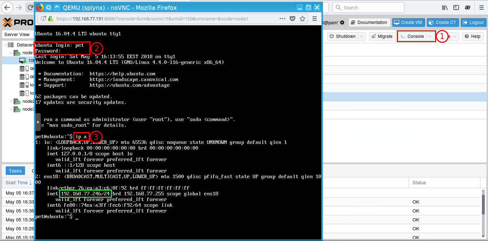
We can see that VM has IP address 192.168.77.246

## Install Splynx

Connect to VM using SSH (we found IP address in the previous step)

Upgrade Linux:

```bash
sudo apt-get update && sudo apt-get -y dist-upgrade
```

Install Splynx:

```bash
wget -qO- https://deb.splynx.com/setup | sudo bash -
sudo apt-get install splynx
```

## HA configuration

Create HA group:

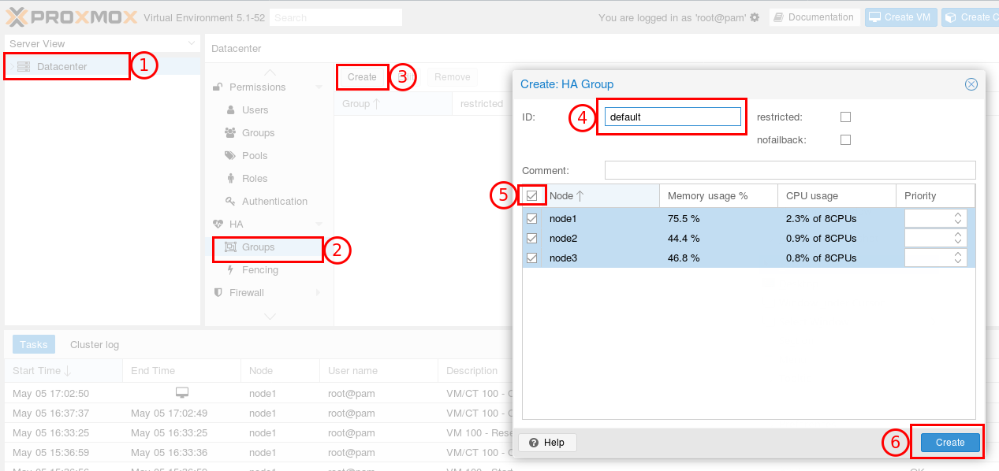

Add VM to this group:

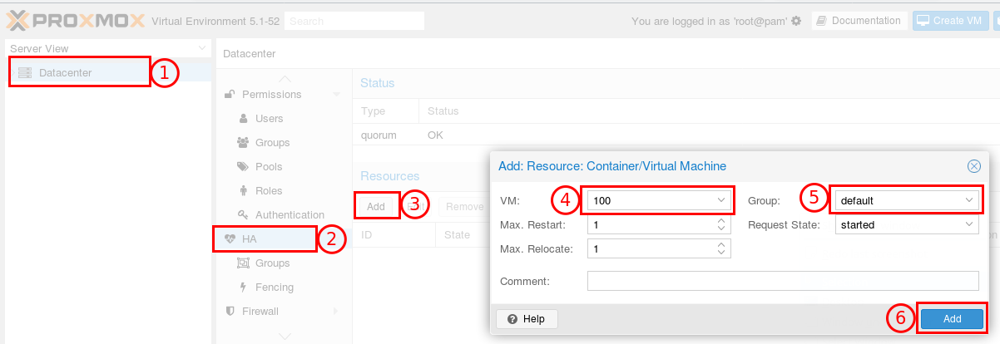

Now we have running VM on node1\. If node1 fails – ProxmoxVE automatically restarts VM on the other node in about 2 minutes.

You can also initiate VM migration to other node:

```bash
bash> ha-manager migrate vm:100 DESTINATION-NODE
```

This uses online migration and tries to keep the VM running. Online migration needs to transfer all used memory over the network, so it is sometimes faster to stop VM, then restart it on the new node. This can be done using the relocate command:

```bash
bash> ha-manager relocate vm:100 DESTINATION-NODE
```

Reference: [https://pve.proxmox.com/wiki/High_Availability](https://pve.proxmox.com/wiki/High_Availability)
