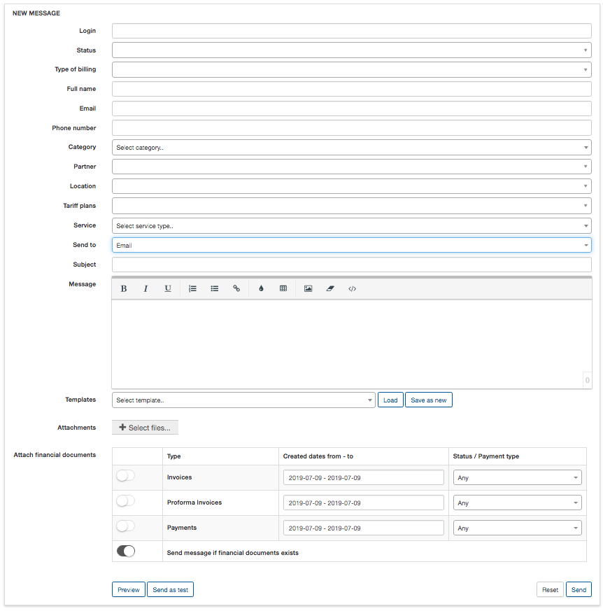
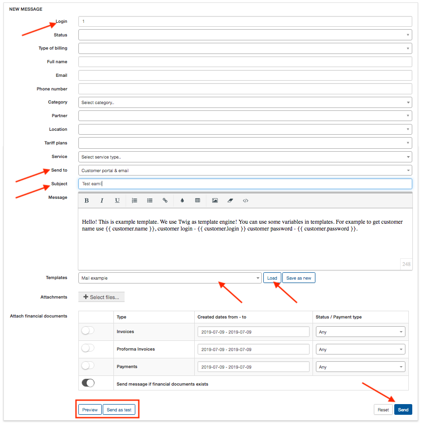
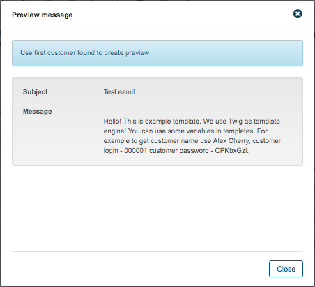
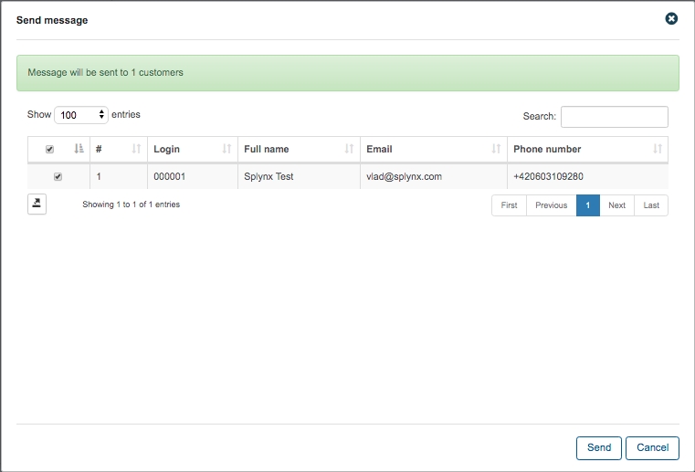
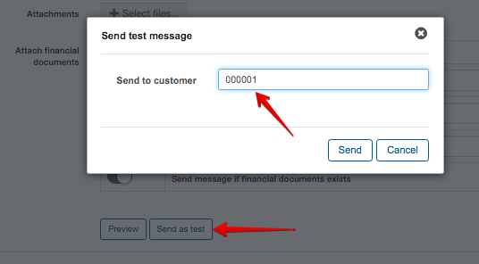
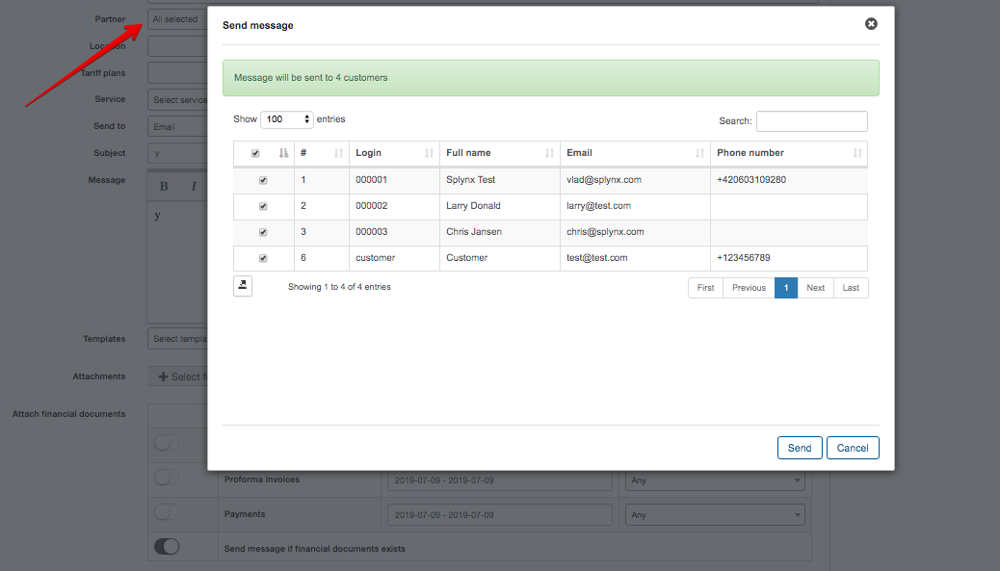
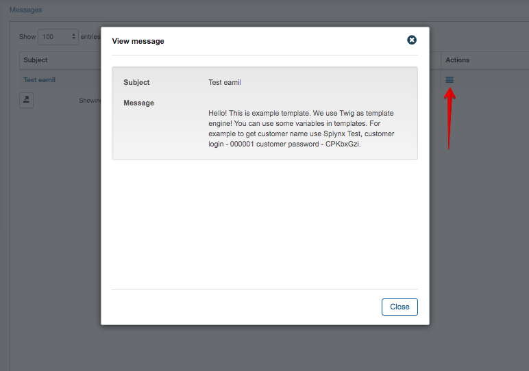
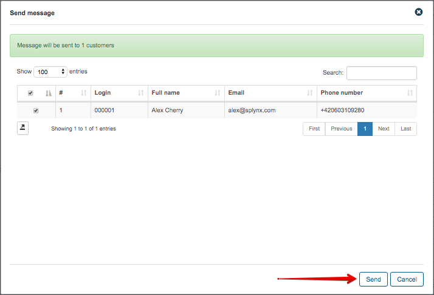

Email messages
==============

Messages' option in Support → Messages allows you to send an email to the customer directly from Splynx using different templates and attaching financial or other documents.

It is necessary to configure email first in Config → Main Configuration → Mail before sending email to the customer. More information about email configuration is here - [Email config](configuration/main_configuration/email_config/email_config.md).

**To create an email** click on Create in Support → Messages. The window will pop-up with the following fields:  

* **ID** - ID of the customer. It has given by the system in a sequential order

* **Login** - user login

* **Status** - there are New, Active, Inactive, Blocked statuses of the customer

* **Type of billing** - Recurring payments or Prepaid options

* **Full name** - full name of the customer

* **Email** - email of the customer

* **Phone number** - phone number of the customer

* **Date added** - date customer was added

* **Category** -  could be Private person or Company

* **Partner** - partner, service provider of the customer

* **Location** - location of the customer

* **Tariff plans** - all available tariff plans in Internet, Voice, Custom services

* **Service** - Internet service, Voice service and Custom service

* **Send to** - the options are: Email, Customer portal, Customer portal & Email, SMS

* **Subject** - Subject of the email

* **Message** - Body of the message

* **Templates** - Templates of Customer portal and Mail templates can be used.

* **Attachments** - individual attachments

* **Attach financial documents** - Invoices, Proforma Invoices and Payments from Splynx.

It is not necessary to fill in all fields to send an email to the customer. The easiest way is to enter customer's ID, choose option Send to, Subject and write a message. You can choose a body message from templates or write a particular text. You can also write your own message and save it as a new template by clicking on Save as new. You can attach financial documents of the customer (invoices, proforma invoices and payments receipts).

You can check your message before sending it by clicking on Preview option at the bottom of the page.

When you click on Send icon the window will appear with the confirmation details of the recipient.

If you click on Send as test  the window will pop-up, where customer's ID have to be entered.

There is an option of mass sending, for example, you can choose particular recipients by Partner or Location.

If you choose the sending option as Sent to Customer portal or Customer Portal & email, customer will be able to read an email in his portal in Messages section, where all incoming emails will be shown.

By clicking on *View* <icon class="image-icon"></icon> the email will show up with attachment enclosed.

All emails have been sent will be possible to check in Support → Messages → History. You can sort them by their status (Any, New, Processing, Sent, Cancelled, Removed, Sent with error) or period of time (Today, Yesterday, Last 7 days, This month, Last month, Custom Range).

By clicking on actions <icon class="image-icon"></icon> you'll be able to see customers' list (in case of mass sending it will be a full list with customers' names), view email and delete it.

It is also possible to check all recipients list by their IDs and Email addresses in Administration → Logs → Email, where you can set a particular period, type of email message or status.

