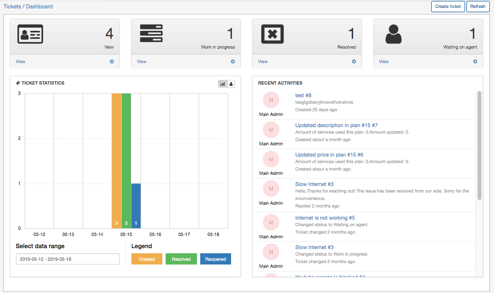
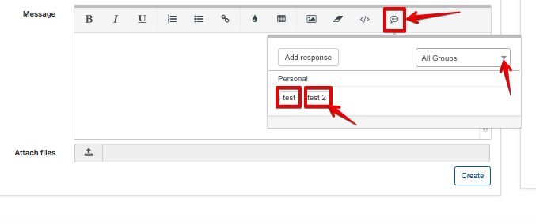
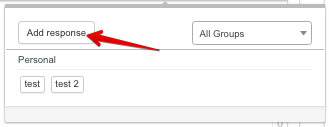
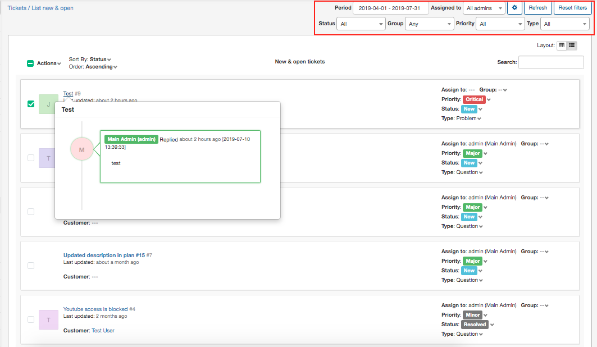
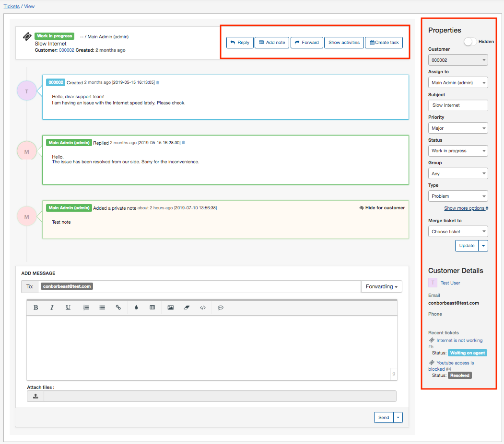
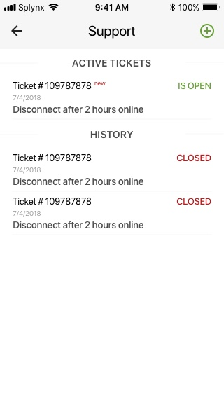

Tickets
=======

Splynx is a complete solution that allows ISPs to manage a lot of business processes in one place instead of switching across different platforms. We brought our ticketing system to the next level in the v.2.3.  

Ticketing platform is tailored to telecoms-specific needs, this means that you can do much more than just replying to the emails. Assign the tickets to the right person,  prioritize the work and schedule the tasks for the technicians and much more.

**ADMINISTRATORS**

**Dashboard**

The ticketing dashboard shows the following sections:
* Status of current tickets.
* General and per-agent statistics
* Live log of recent activities.

The administrator creates the tickets in 2 ways:
1. From the Dashboard in `Support > Tickets > Dashboard` and clicking **Create** in the right top corner.

2. Directly from customer's profile by clicking on the **Support** button and choosing **Create** from the drop-down menu.

After this you will be redirected to the *'Create ticket'* window where the following options are available:

* **Customer** - which customer is ticket open for;
* **Assign** to - who you want to assign the ticket to;
* **Priority** - it can be Minor, Major, Critical;
* **Status** - it can be New, Work in Progress, Waiting for Customer, Waiting on agent, Resolved;
* **Group** - filtered group of admins;
* **Type** - Question, Problem, Incident, Feature request, Lead;
* **Message** - write the message body;
* **File** - possibility to attach a file.

It is possible to add a canned response to the message body to optimize the productivity of admins.

New canned responses can be added by clicking **Add response** button

or in `Config > Ticket canned responses`.

Option *Hidden* <icon class="image-icon"></icon> allows you to hide ticket from a customer.

It is possible to create a [new field](customer_management/custom_additional_fields/custom_additional_fields.md) in the ticket. Information about **adding custom fields** is available here - [Additional fields](configuration/system/additional_fields/additional_fields.md). Remember, that in order to see the new field in the main table, you should enable it by clicking on icon <icon class="image-icon"></icon> below the table.

The created ticket will be visible in the `New and opened tickets` table. It is even possible **to filter the ticket** by *Period, Customer, Group, Type and Assigned to*.

It is possible to assign the ticket, change the status, priority etc. directly from the tickets table.

The ticket working area is divided into 3 parts: *ticket properties, action buttons and messages area*.

* In the properties we can assign the ticket to the right person, change status, prioritize the work, assign to a specific group and set the ticket type.  We also oversee the Customer's information like Name, Email, Phone number and recent tickets.

* The action buttons allow us to add a note, reply or forward the answer, check all ticket activities and schedule the task for an engineer directly within the ticket.

Once the ticket has been resolved, you can change the status on *closed* and close the ticket or press the button **Update and Close** right after the answer. Every closed ticket is shown in `Support → Tickets → List of closed`.

------

**CUSTOMERS**

Your customer can create a ticket in three ways:

1. By sending a query  to your incoming email, like *support@yourdomain.com*, and the ticket will be created automatically in the system. Please, find the incoming mail configuration by the following [link](configuration/main_configuration/incoming_mail.md).

2. By creating a ticket from Customers Portal in `Tickets > Create`

* **Subject** - the subject of the ticket;
* **Priority** - it can be: Minor, Major, Critical;
* **Message** - the message;
* **File** - possibility to attach a file.

Once the ticket is created it is possible to view it or close by using the following icons <icon class="image-icon"></icon>:

3. By creating a ticket from Splynx mobile self-service app.

Information about **tickets configuration** can be found here - [Support](configuration/main_configuration/support/support.md).
