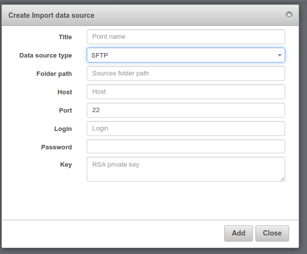

Auto processing
==========

The Voice auto CDR processing is managed here. We can import CDR's to charge the customer and print the register of calls in their invoice.

The process is similar to Voice/Processing/CDR import, but here we can import many CDR's together.

To import CDR's you need to go to the source and configure "Import data source".  Navigate to `Config / Voice / Import Data Source`

Here you need to set the following parameters:

  * Title - provide a name.

  * Data source type - select a type from drop-down menu.

    * SFTP - if you select "SFTP" then you will need to enter a RSA private key

    * FTP - if you select "FTP" then you will need to set the same parameters as for "SFTP" but without a RSA key

    * Local - if you select "Local" then you will only need to set a Title and Folder path.

  * Folder path - insert the path to the relevant folder

  * Host - insert your host IP address

Now you need to go to `Config / Voice / Auto CDR processing` and create Import data source

Here you need to set the following parameters:

  * Title - provide a name.

  * Import data source - select a data source from the drop-down menu

  * File name pattern - Regex for filtering file names (uses pcre syntax):
    Will process all the files that have pattern entrances in a file name. [Examples](voice/auto_cdr_processing/examples/examples.md).

  * First row contains column names - you can enable this option if the first row in your CDR's contains columns names

  * Delimiter - select a delimiter from drop-down menu

  * Type - select the type of data you would import from the drop-down menu

  * Data unit - (If type = Mixed or Data) select a unit from the drop-down menu

  * Voice provider - select a provider from the drop-down menu (if you have providers configured)

  * Import handler - select your handler from the drop-down menu

  * Launch time interval - How often auto processing will be executed

  * Enable - If this is enabled, an auto processing task  will be executed every 'Launch time' interval.

After Auto CDR processing is added, you can run it manually, navigate to `Config / Voice / Auto CDR processing` and click the "Run import" button.

If something went wrong, you can view the errors in Auto CDR processing history. Simply click on the "History" button and you will see the errors. Here you can also Reprocess the errors:

