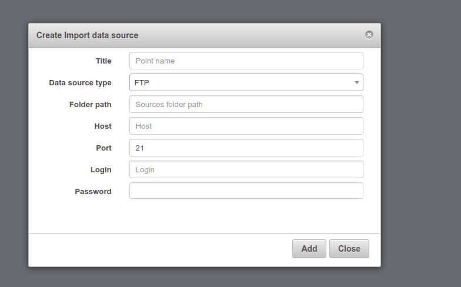
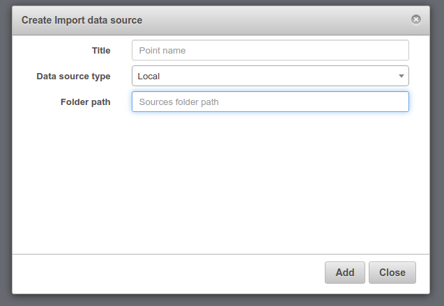
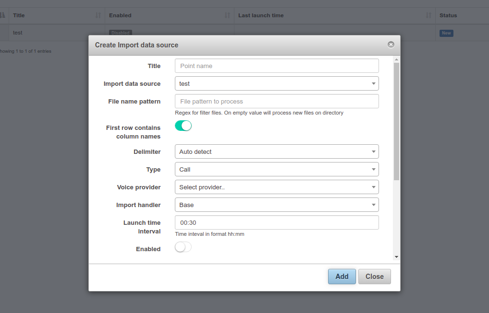

Auto processing
==========

The Voice auto CDR processing is managed here. We can import a CDR's to charge the customer and print the register of calls in his invoice.

The process is similar to Voice/Processing/CDR import, but here we can import many CDR's together.

To import CDR's you need to go to the source and configure "Import data source"

Here you need to set:

  * Title - any name.

  * Data source type - select type from drop-down menu.

    * SFTP - if you select "SFTP" then you will need to enter RSA private key

    * FTP - if you select "FTP" then you will need to set the same parameters as for "SFTP" but without RSA key

    * Local - if you select "Local" then you will need to set only Title and Folder path

  * Folder path - set your path to folder

  * Host - set your host IP address

Now you need to go to the Config / Voice / Auto CDR processing and create Import data source

Here you can set:

  * Title - any name.

  * Import data source - select data source from the drop-down menu

  * File name pattern - Regex for filtering file names (uses pcre syntax):
    Will process all the files that have pattern entrances in a file name.

#### Examples:

    AB-CDR-20190201013000-1-0025B516891F-125464.csv

    BC-CDR-20190201013000-2-0025B516891C-125465.csv

    BC-CDR-20180201013000-3-0025B5168912-12546.csv

|Pattern         | Description                                                           |
|----------------|-----------------------------------------------------------------------|
|AB              | Will filter the file names that have 'AB' symbols                     |
|CDR             | Will match all 3 files                                                |
|2019            | Will match the first two files which contain '2019' in their names    |
|516891[A-Z]     | Will match the first two files with matches 516891F, 516891C          |
|516891[F2]      | Will match the first and the third files with matches 516891F, 5168912|
|516891[F2]-\d{6}|  Will match only the first one                                        |

**Some of special characters:**

Quantifiers:* + ? and {}

|Quantifier              | Description                                                                    |
|------------------------|--------------------------------------------------------------------------------|
|abc*                    | Matches a string that has ab followed by zero or more c                        |
|abc+                    | Matches a string that has ab followed by one or more c                         |
|abc?                    | Matches a string that has ab followed by zero or one c                         |
|abc{2}                  | Matches a string that has ab followed by 2 c                                   |
|abc{2,}                 | Matches a string that has ab followed by 2 or more c                           |
|abc{2,5}                | Matches a string that has ab followed by 2 up to 5 c                           |
|a(bc)*                  | Matches a string that has a followed by zero or more copies of the sequence bc |
|a(bc){2,5}              | Matches a string that has a followed by 2 up to 5 copies of the sequence bc    |

 OR operator:| or []

|Operator | Description                                                              |
|---------|--------------------------------------------------------------------------|
|a(b|c)   | Matches a string that has a followed by b or c                           |
|a[bc]    | Same as previous                                                         |

Character classes:

| Class | Description                                                                |
|-------|----------------------------------------------------------------------------|
| \d    | Matches a single character that is a digit                                 |
| \w    | Matches a word character (alphanumeric character plus underscore)          |
| \s    | Matches a whitespace character (includes tabs and line breaks)             |
| .     | Matches any character                                                      |

  * First row contains column names - turn it on if the first row in your CDR's contains columns names

  * Delimiter - select a delimeter from drop-down menu

  * Type - select from drop-down menu type of data what you would import

  * Data unit - (If type = Mixed or Data) select from drop menu

  * Voice provider - select a provider from the drop-down menu (if you have it)

  * Import handler - select your handler from the drop-down menu

  * Launch time interval - How often an auto processing will be running

  * Enable - In case it is on, an auto processing will be running every 'Launch time' interval.

After that Auto CDR processing is added, you can run it manually, go to the Config / Voice / Auto CDR processing and press "Run import" button.
In case something is wrong, you can see it in Auto CDR processing history, for this press "History" button, and you will see errors, here you can also Reprocess the errors:

